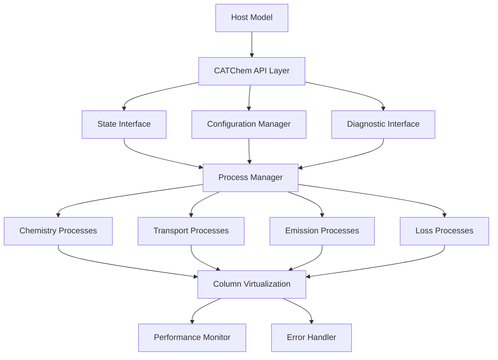

# Integration Patterns Guide

This guide provides comprehensive documentation for CATChem's integration capabilities, covering design patterns, coupling strategies, and best practices for integrating with various Earth system modeling frameworks.

## Overview

CATChem's integration architecture supports:

- **NUOPC Compliance**: Earth System Modeling Framework integration
- **CCPP Compatibility**: Common Community Physics Package support
- **FV3 Integration**: Finite-Volume Cubed-Sphere Dynamical Core coupling
- **Standalone Operation**: Independent atmospheric chemistry modeling
- **API-Based Integration**: Flexible programmatic interfaces

## Integration Architecture

### Core Integration Framework



### Integration Interface

```fortran
module CATChemAPI_Mod
  use StateInterface_Mod
  use ConfigManager_Mod
  use ProcessManager_Mod
  use ErrorHandling_Mod

  implicit none

  type :: CATChemAPI_t
    type(ProcessManager_t) :: process_manager
    type(StateInterface_t) :: state_interface
    type(ConfigManager_t) :: config_manager
    type(DiagnosticInterface_t) :: diagnostics
    logical :: is_initialized = .false.
  contains
    procedure :: initialize => api_initialize
    procedure :: run => api_run
    procedure :: finalize => api_finalize
    procedure :: update_state => api_update_state
    procedure :: get_tendencies => api_get_tendencies
  end type CATChemAPI_t
```

## NUOPC Integration Pattern

### NUOPC Component Structure

```fortran
module CATChem_NUOPC_Mod
  use ESMF
  use NUOPC
  use CATChemAPI_Mod

  implicit none

  type(CATChemAPI_t), save :: catchem_instance

  public :: SetServices

contains

  subroutine SetServices(model, rc)
    type(ESMF_GridComp) :: model
    integer, intent(out) :: rc

    ! Register NUOPC generic methods
    call NUOPC_CompDerive(model, model_SS, rc=rc)
    if (ESMF_LogFoundError(rcToCheck=rc, msg=ESMF_CONTEXT, rcToReturn=rc)) return

    ! Set entry points for initialize, run, finalize
    call NUOPC_CompSetEntryPoint(model, ESMF_METHOD_INITIALIZE, &
                                 phaseLabelList=(/"IPDv00p1"/), &
                                 userRoutine=InitializeP1, rc=rc)

    call NUOPC_CompSetEntryPoint(model, ESMF_METHOD_RUN, &
                                 userRoutine=ModelAdvance, rc=rc)

    call NUOPC_CompSetEntryPoint(model, ESMF_METHOD_FINALIZE, &
                                 userRoutine=ModelFinalize, rc=rc)
  end subroutine SetServices
```

### State Management

```fortran
! NUOPC state exchange
subroutine exchange_fields_with_mediator(model, importState, exportState, &
                                        clock, rc)
  type(ESMF_GridComp) :: model
  type(ESMF_State) :: importState, exportState
  type(ESMF_Clock) :: clock
  integer, intent(out) :: rc

  type(ESMF_Field) :: field
  real(ESMF_KIND_R8), pointer :: dataPtr(:,:,:)

  ! Import meteorological fields
  call ESMF_StateGet(importState, "air_temperature", field, rc=rc)
  call ESMF_FieldGet(field, farrayPtr=dataPtr, rc=rc)
  call catchem_instance%update_state("temperature", dataPtr, rc)

  ! Import chemical species
  call ESMF_StateGet(importState, "ozone_concentration", field, rc=rc)
  call ESMF_FieldGet(field, farrayPtr=dataPtr, rc=rc)
  call catchem_instance%update_state("O3", dataPtr, rc)

  ! Run CATChem processes
  call catchem_instance%run(time_step, rc)

  ! Export updated species concentrations
  call catchem_instance%get_state("O3", dataPtr, rc)
  call ESMF_StateGet(exportState, "ozone_concentration", field, rc=rc)
  call ESMF_FieldGet(field, farrayPtr=dataPtr, rc=rc)

end subroutine exchange_fields_with_mediator
```

### NUOPC Metadata

```fortran
! NUOPC advertise fields
subroutine AdvertiseFields(model, rc)
  type(ESMF_GridComp) :: model
  integer, intent(out) :: rc

  ! Advertise import fields
  call NUOPC_Advertise(model, importFields=importFields, rc=rc)
  call NUOPC_Advertise(model, exportFields=exportFields, rc=rc)

  contains

  character(len=*), parameter :: importFields(*) = (/ &
    "air_temperature               ", &
    "air_pressure                  ", &
    "specific_humidity             ", &
    "eastward_wind                 ", &
    "northward_wind                ", &
    "surface_air_pressure          ", &
    "precipitation_flux            " /)

  character(len=*), parameter :: exportFields(*) = (/ &
    "ozone_concentration           ", &
    "nitrogen_dioxide_concentration", &
    "particulate_matter_25         ", &
    "chemistry_tendency_temperature" /)

end subroutine AdvertiseFields
```

## CCPP Integration Pattern

### CCPP Scheme Structure

```fortran
module catchem_ccpp_scheme
  use CATChemAPI_Mod
  use ccpp_kinds, only: kind_phys

  implicit none

  public :: catchem_ccpp_init, catchem_ccpp_run, catchem_ccpp_finalize

contains

  subroutine catchem_ccpp_init(mpicomm, mpirank, mpiroot, &
                               errmsg, errflg)

    integer, intent(in) :: mpicomm, mpirank, mpiroot
    character(len=*), intent(out) :: errmsg
    integer, intent(out) :: errflg

    type(ErrorCode_t) :: rc

    ! Initialize CATChem instance
    call catchem_instance%initialize(config_file="catchem_ccpp.yml", rc=rc)

    if (rc%is_error()) then
      errflg = 1
      errmsg = "CATChem initialization failed: " // rc%get_message()
    else
      errflg = 0
      errmsg = ""
    end if

  end subroutine catchem_ccpp_init

  subroutine catchem_ccpp_run(nCol, nLev, dt, &
                              temp, pres, qv, u, v, &
                              o3, no2, pm25, &
                              errmsg, errflg)

    integer, intent(in) :: nCol, nLev
    real(kind_phys), intent(in) :: dt
    real(kind_phys), intent(in) :: temp(nCol,nLev)
    real(kind_phys), intent(in) :: pres(nCol,nLev)
    real(kind_phys), intent(in) :: qv(nCol,nLev)
    real(kind_phys), intent(in) :: u(nCol,nLev)
    real(kind_phys), intent(in) :: v(nCol,nLev)
    real(kind_phys), intent(inout) :: o3(nCol,nLev)
    real(kind_phys), intent(inout) :: no2(nCol,nLev)
    real(kind_phys), intent(inout) :: pm25(nCol,nLev)
    character(len=*), intent(out) :: errmsg
    integer, intent(out) :: errflg

    type(ErrorCode_t) :: rc
    integer :: col

    ! Update meteorological state for each column
    do col = 1, nCol
      call catchem_instance%update_column_met(col, temp(col,:), &
                                              pres(col,:), qv(col,:), rc)
      if (rc%is_error()) exit
    end do

    ! Update chemical species
    do col = 1, nCol
      call catchem_instance%update_column_species(col, "O3", o3(col,:), rc)
      call catchem_instance%update_column_species(col, "NO2", no2(col,:), rc)
      if (rc%is_error()) exit
    end do

    ! Run chemistry processes
    call catchem_instance%run(real(dt, r8), rc)

    ! Retrieve updated concentrations
    do col = 1, nCol
      call catchem_instance%get_column_species(col, "O3", o3(col,:), rc)
      call catchem_instance%get_column_species(col, "NO2", no2(col,:), rc)
      if (rc%is_error()) exit
    end do

    if (rc%is_error()) then
      errflg = 1
      errmsg = "CATChem run failed: " // rc%get_message()
    else
      errflg = 0
      errmsg = ""
    end if

  end subroutine catchem_ccpp_run
```

### CCPP Metadata File

```
[ccpp-table-properties]
  name = catchem_ccpp_scheme
  type = scheme
  dependencies =

[ccpp-arg-table]
  name = catchem_ccpp_run
  type = scheme
[nCol]
  standard_name = horizontal_loop_extent
  long_name = horizontal loop extent
  units = count
  dimensions = ()
  type = integer
  intent = in
[nLev]
  standard_name = vertical_layer_dimension
  long_name = number of vertical levels
  units = count
  dimensions = ()
  type = integer
  intent = in
[dt]
  standard_name = timestep_for_chemistry
  long_name = chemistry timestep
  units = s
  dimensions = ()
  type = real
  kind = kind_phys
  intent = in
[temp]
  standard_name = air_temperature
  long_name = air temperature
  units = K
  dimensions = (horizontal_loop_extent,vertical_layer_dimension)
  type = real
  kind = kind_phys
  intent = in
```

## FV3 Integration Pattern

### FV3 Coupling Interface

```fortran
module CATChem_FV3_Coupling_Mod
  use fv_dynamics_mod
  use fv_mapz_mod
  use CATChemAPI_Mod

  implicit none

  type :: FV3CouplingManager_t
    type(CATChemAPI_t) :: catchem
    type(fv_atmos_type), pointer :: atm
    logical :: is_coupled = .false.
  contains
    procedure :: initialize_coupling => fv3_initialize_coupling
    procedure :: couple_dynamics => fv3_couple_dynamics
    procedure :: update_tracers => fv3_update_tracers
  end type FV3CouplingManager_t

  type(FV3CouplingManager_t), save :: coupling_manager
```

### Tracer Transport Integration

```fortran
subroutine fv3_update_tracers(this, dt, rc)
  class(FV3CouplingManager_t), intent(inout) :: this
  real(r8), intent(in) :: dt
  type(ErrorCode_t), intent(out) :: rc

  integer :: i, j, k, n_tracers
  real(r8), pointer :: tracer_data(:,:,:)

  ! Get number of chemical tracers
  n_tracers = this%atm%ncnst

  ! Update each tracer
  do n = 1, n_tracers
    ! Extract tracer from FV3 state
    tracer_data => this%atm%q(:,:,:,n)

    ! Update CATChem state
    call this%catchem%update_tracer(n, tracer_data, rc)
    if (rc%is_error()) return
  end do

  ! Run chemistry processes
  call this%catchem%run(dt, rc)
  if (rc%is_error()) return

  ! Update FV3 tracers with chemistry tendencies
  do n = 1, n_tracers
    call this%catchem%get_tracer_tendency(n, tracer_data, rc)
    if (rc%is_error()) return

    ! Apply tendency to FV3 tracer
    this%atm%q(:,:,:,n) = this%atm%q(:,:,:,n) + tracer_data * dt
  end do

end subroutine fv3_update_tracers
```

### Grid Mapping

```fortran
! FV3 cubed-sphere to CATChem column mapping
subroutine map_fv3_to_columns(fv3_data, column_data, grid_mapping, rc)
  real(r8), intent(in) :: fv3_data(:,:,:)  ! (npx, npy, npz)
  real(r8), intent(out) :: column_data(:,:) ! (num_columns, num_levels)
  type(GridMapping_t), intent(in) :: grid_mapping
  type(ErrorCode_t), intent(out) :: rc

  integer :: tile, i, j, k, col_idx

  col_idx = 0
  do tile = 1, 6  ! Six faces of cubed sphere
    do j = 1, grid_mapping%npy
      do i = 1, grid_mapping%npx
        col_idx = col_idx + 1

        ! Copy vertical profile to column
        do k = 1, grid_mapping%npz
          column_data(col_idx, k) = fv3_data(i, j, k)
        end do
      end do
    end do
  end do

end subroutine map_fv3_to_columns
```

## Standalone Integration Pattern

### Standalone Driver

```fortran
program catchem_standalone_driver
  use CATChemAPI_Mod
  use NetCDFIO_Mod
  use ConfigManager_Mod

  implicit none

  type(CATChemAPI_t) :: catchem
  type(NetCDFIO_t) :: input_io, output_io
  type(ConfigManager_t) :: config
  type(ErrorCode_t) :: rc

  character(len=256) :: config_file
  real(r8) :: current_time, end_time, time_step
  integer :: time_index

  ! Parse command line arguments
  call get_command_argument(1, config_file)
  if (len_trim(config_file) == 0) then
    config_file = "catchem_standalone.yml"
  end if

  ! Initialize configuration
  call config%load_config(config_file, rc)
  if (rc%is_error()) then
    print*, "Configuration error: ", rc%get_message()
    stop 1
  end if

  ! Initialize CATChem
  call catchem%initialize(config, rc)
  if (rc%is_error()) then
    print*, "CATChem initialization error: ", rc%get_message()
    stop 1
  end if

  ! Initialize I/O
  call input_io%open_for_read(config%get_input_file(), rc)
  call output_io%open_for_write(config%get_output_file(), rc)

  ! Main time loop
  current_time = config%get_start_time()
  end_time = config%get_end_time()
  time_step = config%get_time_step()
  time_index = 1

  do while (current_time < end_time)
    ! Read input data for current time
    call input_io%read_timestep(time_index, catchem%state_interface, rc)
    if (rc%is_error()) exit

    ! Run CATChem for one timestep
    call catchem%run(time_step, rc)
    if (rc%is_error()) exit

    ! Write output data
    call output_io%write_timestep(time_index, catchem%state_interface, rc)
    if (rc%is_error()) exit

    ! Advance time
    current_time = current_time + time_step
    time_index = time_index + 1

    ! Progress reporting
    if (mod(time_index, 24) == 0) then
      print*, "Completed day ", time_index / 24
    end if
  end do

  ! Cleanup
  call catchem%finalize(rc)
  call input_io%close()
  call output_io%close()

  if (rc%is_error()) then
    print*, "Runtime error: ", rc%get_message()
    stop 1
  else
    print*, "CATChem standalone run completed successfully"
  end if

end program catchem_standalone_driver
```

## API-Based Integration

### High-Level API

```fortran
! Simplified API for easy integration
module CATChemSimpleAPI_Mod
  use CATChemAPI_Mod

  implicit none

  private
  public :: catchem_simple_init, catchem_simple_run, catchem_simple_finalize
  public :: catchem_set_meteorology, catchem_set_species
  public :: catchem_get_species, catchem_get_diagnostics

  type(CATChemAPI_t), save :: simple_api_instance

contains

  integer function catchem_simple_init(config_file) result(status)
    character(len=*), intent(in) :: config_file
    type(ErrorCode_t) :: rc

    call simple_api_instance%initialize(config_file, rc)
    status = merge(0, 1, rc%is_success())
  end function catchem_simple_init

  integer function catchem_simple_run(time_step) result(status)
    real(8), intent(in) :: time_step
    type(ErrorCode_t) :: rc

    call simple_api_instance%run(time_step, rc)
    status = merge(0, 1, rc%is_success())
  end function catchem_simple_run

  integer function catchem_set_species(species_name, concentrations) result(status)
    character(len=*), intent(in) :: species_name
    real(8), intent(in) :: concentrations(:,:)
    type(ErrorCode_t) :: rc

    call simple_api_instance%update_state(species_name, concentrations, rc)
    status = merge(0, 1, rc%is_success())
  end function catchem_set_species

end module CATChemSimpleAPI_Mod
```

### C/C++ Interface

```c
// C interface for CATChem integration
#include "catchem_c_interface.h"

typedef struct {
    void* catchem_handle;
    int is_initialized;
} catchem_instance_t;

// C API functions
int catchem_init(catchem_instance_t* instance, const char* config_file);
int catchem_run(catchem_instance_t* instance, double time_step);
int catchem_set_meteorology(catchem_instance_t* instance,
                           const double* temperature,
                           const double* pressure,
                           const double* humidity,
                           int num_columns, int num_levels);
int catchem_get_species(catchem_instance_t* instance,
                       const char* species_name,
                       double* concentrations,
                       int num_columns, int num_levels);
int catchem_finalize(catchem_instance_t* instance);
```

### Python Interface

```python
# Python wrapper using ctypes
import ctypes
import numpy as np
from ctypes import c_double, c_int, c_char_p, POINTER

class CATChemPython:
    def __init__(self, config_file):
        # Load CATChem shared library
        self.lib = ctypes.CDLL('./libcatchem.so')

        # Define function signatures
        self.lib.catchem_init.argtypes = [ctypes.c_void_p, c_char_p]
        self.lib.catchem_init.restype = c_int

        self.lib.catchem_run.argtypes = [ctypes.c_void_p, c_double]
        self.lib.catchem_run.restype = c_int

        # Initialize instance
        self.instance = ctypes.c_void_p()
        status = self.lib.catchem_init(ctypes.byref(self.instance),
                                       config_file.encode('utf-8'))
        if status != 0:
            raise RuntimeError("CATChem initialization failed")

    def run(self, time_step):
        status = self.lib.catchem_run(self.instance, c_double(time_step))
        if status != 0:
            raise RuntimeError("CATChem run failed")

    def set_species(self, species_name, concentrations):
        # Convert numpy array to C array
        c_array = (c_double * concentrations.size)(*concentrations.flatten())
        status = self.lib.catchem_set_species(self.instance,
                                              species_name.encode('utf-8'),
                                              c_array,
                                              concentrations.shape[0],
                                              concentrations.shape[1])
        if status != 0:
            raise RuntimeError(f"Failed to set species {species_name}")
```

## Integration Best Practices

### Error Handling

```fortran
! Robust error handling in integration
subroutine robust_integration_step(host_model, catchem, dt, rc)
  type(HostModel_t), intent(inout) :: host_model
  type(CATChemAPI_t), intent(inout) :: catchem
  real(r8), intent(in) :: dt
  type(ErrorCode_t), intent(out) :: rc

  type(ErrorCode_t) :: local_rc

  ! Save state for potential rollback
  call host_model%save_state(local_rc)
  if (local_rc%is_error()) then
    call rc%set_error("Failed to save host model state")
    return
  end if

  ! Update CATChem with host model state
  call update_catchem_from_host(host_model, catchem, local_rc)
  if (local_rc%is_error()) then
    call rc%add_context("Failed to update CATChem state")
    call host_model%restore_state(local_rc)
    return
  end if

  ! Run CATChem
  call catchem%run(dt, local_rc)
  if (local_rc%is_error()) then
    if (local_rc%is_recoverable()) then
      ! Try with reduced timestep
      call catchem%run(dt * 0.5_r8, local_rc)
      if (local_rc%is_success()) then
        call catchem%run(dt * 0.5_r8, local_rc)
      end if
    end if

    if (local_rc%is_error()) then
      call rc%add_context("CATChem run failed")
      call host_model%restore_state(local_rc)
      return
    end if
  end if

  ! Update host model with CATChem results
  call update_host_from_catchem(catchem, host_model, local_rc)
  if (local_rc%is_error()) then
    call rc%add_context("Failed to update host model")
    call host_model%restore_state(local_rc)
    return
  end if

  call rc%set_success()
end subroutine robust_integration_step
```

### Performance Optimization

```fortran
! Optimized data exchange
type :: OptimizedDataExchange_t
  real(r8), allocatable :: buffer_in(:,:,:)
  real(r8), allocatable :: buffer_out(:,:,:)
  integer, allocatable :: column_mapping(:)
  logical :: use_direct_mapping = .false.
contains
  procedure :: exchange_data => ode_exchange_data
  procedure :: optimize_mapping => ode_optimize_mapping
end type OptimizedDataExchange_t

subroutine ode_exchange_data(this, host_data, catchem_data, direction, rc)
  class(OptimizedDataExchange_t), intent(inout) :: this
  real(r8), intent(inout) :: host_data(:,:,:)
  real(r8), intent(inout) :: catchem_data(:,:)
  character(len=*), intent(in) :: direction  ! "host_to_catchem" or "catchem_to_host"
  type(ErrorCode_t), intent(out) :: rc

  if (this%use_direct_mapping) then
    ! Direct memory mapping for compatible layouts
    call direct_memory_exchange(host_data, catchem_data, direction, rc)
  else
    ! Buffer-based exchange for different layouts
    call buffered_exchange(this, host_data, catchem_data, direction, rc)
  end if
end subroutine ode_exchange_data
```

## Related Documentation

- [NUOPC Integration Guide](../../developer-guide/integration/nuopc.md)
- [CCPP Integration Guide](../../developer-guide/integration/ccpp.md)
- [FV3 Integration Guide](../../developer-guide/integration/fv3.md)
- [API Reference](../../api/index.md)
- [Configuration Management](configuration-management.md)

---

*This integration patterns guide provides comprehensive strategies for coupling CATChem with various Earth system modeling frameworks. For specific integration examples and troubleshooting, consult the individual integration guides.*
