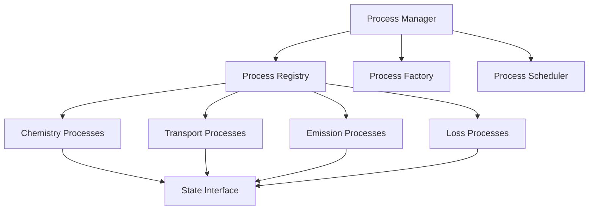

# Process Infrastructure Guide

This guide provides comprehensive documentation for CATChem's process infrastructure, covering the fundamental architecture, design patterns, and implementation details that enable flexible and efficient atmospheric chemistry modeling.

## Overview

The process infrastructure is the foundation of CATChem's modular design, providing:

- **Unified Interface**: Consistent API for all atmospheric processes
- **State Management**: Centralized data flow and dependency tracking
- **Column Virtualization**: Efficient 1D processing with automatic parallelization
- **Diagnostic Integration**: Built-in monitoring and performance tracking
- **Configuration Management**: Flexible, runtime-configurable process setup

## Architecture Principles

### Process-Based Design



### Core Components

1. **ProcessInterface**: Abstract base class defining the process contract
2. **ProcessManager**: Orchestrates process execution and dependencies
3. **ProcessRegistry**: Maintains catalog of available processes
4. **ProcessFactory**: Creates and configures process instances
5. **ProcessScheduler**: Determines execution order and parallelization

## Process Interface Specification

### Base Interface

```fortran
module ProcessInterface_Mod
  use StateManager_Mod, only: StateManagerType
  use ColumnInterface_Mod, only: VirtualColumnType
  use DiagnosticInterface_Mod
  use Error_Mod

  implicit none

  type, abstract :: ProcessInterface
    private
    character(len=64) :: name = ''
    character(len=64) :: version = ''
    character(len=256) :: description = ''
    logical :: is_initialized = .false.
    logical :: is_active = .false.
    real(fp) :: dt = 0.0_fp
  contains
    procedure(init_interface), deferred :: init
    procedure(run_interface), deferred :: run
    procedure(finalize_interface), deferred :: finalize
    procedure :: get_required_met_fields
    procedure :: get_required_diagnostic_fields
    procedure :: get_name
    procedure :: get_version
    procedure :: is_process_initialized
  end type ProcessInterface

  !> Column-based process interface for efficient 1D processing
  type, abstract, extends(ProcessInterface) :: ColumnProcessInterface
  contains
    procedure(run_column_interface), deferred :: run_column
    procedure :: supports_column_processing
  end type ColumnProcessInterface
```

### Required Methods

#### Initialize Method
```fortran
abstract interface
  subroutine init_interface(this, state_manager, rc)
    import :: ProcessInterface, StateManagerType
    class(ProcessInterface), intent(inout) :: this
    type(StateManagerType), intent(inout) :: state_manager
    integer, intent(out) :: rc
  end subroutine init_interface
end interface
```

#### Run Method
```fortran
abstract interface
  subroutine run_interface(this, time_step, state_manager, rc)
    import :: ProcessInterface, StateManagerType, fp
    class(ProcessInterface), intent(inout) :: this
    real(fp), intent(in) :: time_step
    type(StateManagerType), intent(inout) :: state_manager
    integer, intent(out) :: rc
  end subroutine run_interface
end interface
```

#### Finalize Method
```fortran
abstract interface
  subroutine finalize_interface(this, rc)
    import :: ProcessInterface
    class(ProcessInterface), intent(inout) :: this
    integer, intent(out) :: rc
  end subroutine finalize_interface
end interface
```

#### Column Run Method (for ColumnProcessInterface)
```fortran
abstract interface
  subroutine run_column_interface(this, column, time_step, rc)
    import :: ColumnProcessInterface, VirtualColumnType, fp
    class(ColumnProcessInterface), intent(inout) :: this
    type(VirtualColumnType), intent(inout) :: column
    real(fp), intent(in) :: time_step
    integer, intent(out) :: rc
  end subroutine run_column_interface
end interface
```

## Process Manager

### Initialization

```fortran
module ProcessManager_Mod
  use ProcessInterface_Mod
  use ProcessRegistry_Mod
  use ProcessFactory_Mod

  type :: ProcessManager_t
    type(ProcessRegistry_t) :: registry
    type(ProcessFactory_t) :: factory
    type(ProcessInterface_t), allocatable :: processes(:)
    integer :: num_processes = 0
  contains
    procedure :: initialize => pm_initialize
    procedure :: add_process => pm_add_process
    procedure :: run_processes => pm_run_processes
    procedure :: finalize => pm_finalize
  end type ProcessManager_t
```

### Process Execution

```fortran
subroutine pm_run_processes(this, time_step, state, diagnostics, rc)
  class(ProcessManager_t), intent(inout) :: this
  real(kind=r8), intent(in) :: time_step
  type(StateInterface_t), intent(inout) :: state
  type(DiagnosticInterface_t), intent(inout) :: diagnostics
  type(ErrorCode_t), intent(out) :: rc

  integer :: i
  type(ErrorCode_t) :: local_rc

  do i = 1, this%num_processes
    if (this%processes(i)%is_active) then
      call this%processes(i)%run(time_step, state, diagnostics, local_rc)
      if (local_rc%is_error()) then
        call rc%set_error("Process execution failed: " // &
                         this%processes(i)%get_name())
        return
      end if
    end if
  end do

  call rc%set_success()
end subroutine pm_run_processes
```

## Process Registry

### Registration System

```fortran
module ProcessRegistry_Mod
  use ProcessInterface_Mod

  type :: ProcessRegistryEntry_t
    character(len=:), allocatable :: name
    character(len=:), allocatable :: category
    character(len=:), allocatable :: description
    character(len=:), allocatable :: version
    procedure(create_process_interface), pointer :: creator => null()
  end type ProcessRegistryEntry_t

  type :: ProcessRegistry_t
    type(ProcessRegistryEntry_t), allocatable :: entries(:)
    integer :: num_entries = 0
  contains
    procedure :: register_process => pr_register_process
    procedure :: find_process => pr_find_process
    procedure :: list_processes => pr_list_processes
  end type ProcessRegistry_t
```

### Process Registration

```fortran
subroutine pr_register_process(this, name, category, description, &
                              version, creator, rc)
  class(ProcessRegistry_t), intent(inout) :: this
  character(len=*), intent(in) :: name
  character(len=*), intent(in) :: category
  character(len=*), intent(in) :: description
  character(len=*), intent(in) :: version
  procedure(create_process_interface) :: creator
  type(ErrorCode_t), intent(out) :: rc

  ! Implementation details...
end subroutine pr_register_process
```

## Process Factory

### Creation Pattern

```fortran
module ProcessFactory_Mod
  use ProcessInterface_Mod
  use ProcessRegistry_Mod

  type :: ProcessFactory_t
    type(ProcessRegistry_t), pointer :: registry => null()
  contains
    procedure :: create_process => pf_create_process
    procedure :: configure_process => pf_configure_process
  end type ProcessFactory_t
```

### Process Creation

```fortran
function pf_create_process(this, name, config, rc) result(process)
  class(ProcessFactory_t), intent(in) :: this
  character(len=*), intent(in) :: name
  type(Configuration_t), intent(in) :: config
  type(ErrorCode_t), intent(out) :: rc
  class(ProcessInterface_t), allocatable :: process

  type(ProcessRegistryEntry_t), pointer :: entry

  entry => this%registry%find_process(name, rc)
  if (rc%is_error()) return

  call entry%creator(process, rc)
  if (rc%is_error()) return

  call this%configure_process(process, config, rc)
end function pf_create_process
```

## Column Virtualization Integration

### Column Processing

```fortran
subroutine process_columns(this, num_columns, column_data, &
                          time_step, diagnostics, rc)
  class(ProcessInterface_t), intent(inout) :: this
  integer, intent(in) :: num_columns
  type(ColumnData_t), intent(inout) :: column_data(:)
  real(kind=r8), intent(in) :: time_step
  type(DiagnosticInterface_t), intent(inout) :: diagnostics
  type(ErrorCode_t), intent(out) :: rc

  integer :: i
  type(ErrorCode_t) :: local_rc

  !$OMP PARALLEL DO PRIVATE(local_rc)
  do i = 1, num_columns
    call this%process_column(column_data(i), time_step, local_rc)
    if (local_rc%is_error()) then
      !$OMP CRITICAL
      call rc%set_error("Column processing failed")
      !$OMP END CRITICAL
    end if
  end do
  !$OMP END PARALLEL DO
end subroutine process_columns
```

## State Interface Integration

### State Access Patterns

```fortran
! Get species concentrations
call state%get_species('O3', o3_concentrations, rc)

! Update species after processing
call state%update_species('O3', o3_concentrations, rc)

! Access meteorological data
call state%get_meteorology('temperature', temperature, rc)

! Update diagnostic fields
call diagnostics%update_field('o3_production_rate', production_rates, rc)
```

## Configuration Management

### Process Configuration

```yaml
processes:
  - name: "gas_phase_chemistry"
    type: "chemistry"
    scheme: "cb6r3"
    active: true
    parameters:
      solver: "rosenbrock"
      relative_tolerance: 1.0e-3
      absolute_tolerance: 1.0e-12

  - name: "aerosol_settling"
    type: "transport"
    scheme: "stokes"
    active: true
    parameters:
      slip_correction: true
      shape_factor: 1.0
```

### Runtime Configuration

```fortran
type :: ProcessConfiguration_t
  character(len=:), allocatable :: name
  character(len=:), allocatable :: scheme
  logical :: active
  type(ParameterList_t) :: parameters
contains
  procedure :: get_parameter
  procedure :: set_parameter
  procedure :: validate
end type ProcessConfiguration_t
```

## Diagnostic Integration

### Process Diagnostics

```fortran
! Register diagnostic fields
call diagnostics%register_field('o3_concentration', 'kg/kg', &
                                'Ozone mass mixing ratio', rc)

! Update diagnostic during processing
call diagnostics%accumulate_field('o3_production', production_rate * dt, rc)

! Output timing information
call diagnostics%record_timing(this%name, elapsed_time, rc)
```

### Performance Monitoring

```yaml
diagnostics:
  process_timing:
    enabled: true
    frequency: "every_timestep"
    output_file: "process_timing.nc"

  memory_usage:
    enabled: true
    frequency: "hourly"
    track_allocations: true
```

## Error Handling

### Error Propagation

```fortran
subroutine example_process_run(this, time_step, state, diagnostics, rc)
  ! Process implementation
  call some_operation(input_data, output_data, local_rc)
  if (local_rc%is_error()) then
    call rc%add_context("In process: " // this%name)
    call rc%add_context("During operation: some_operation")
    return
  end if

  call rc%set_success()
end subroutine example_process_run
```

### Error Recovery

```fortran
! Implement graceful degradation
if (rc%is_error() .and. rc%is_recoverable()) then
  call this%use_fallback_scheme(state, diagnostics, recovery_rc)
  if (recovery_rc%is_success()) then
    call rc%set_warning("Used fallback scheme")
  end if
end if
```

## Testing Infrastructure

### Unit Testing

```fortran
program test_process_infrastructure
  use ProcessInterface_Mod
  use TestFramework_Mod

  type(TestSuite_t) :: suite

  call suite%add_test("test_process_creation", test_process_creation)
  call suite%add_test("test_process_execution", test_process_execution)
  call suite%add_test("test_error_handling", test_error_handling)

  call suite%run()
end program test_process_infrastructure
```

### Integration Testing

```bash
# Test full process chain
ctest -R test_process_chain

# Validate process interactions
ctest -R test_process_dependencies
```

## Performance Optimization

### Memory Management

```fortran
! Use object pools for frequently created objects
type :: ProcessObjectPool_t
  type(ProcessInterface_t), allocatable :: pool(:)
  logical, allocatable :: in_use(:)
  integer :: pool_size
  integer :: next_available
end type ProcessObjectPool_t
```

### Computational Efficiency

```yaml
optimization:
  vectorization: true
  loop_unrolling: 4
  cache_optimization: true
  memory_prefetch: true

parallel:
  openmp: true
  mpi: true
  hybrid: true
```

## Extension Points

### Custom Process Development

```fortran
module MyCustomProcess_Mod
  use ProcessInterface_Mod

  type, extends(ProcessInterface_t) :: MyCustomProcess_t
    ! Custom process data
  contains
    procedure :: initialize => mcp_initialize
    procedure :: run => mcp_run
    procedure :: finalize => mcp_finalize
  end type MyCustomProcess_t
end module MyCustomProcess_Mod
```

### Plugin Architecture

```fortran
! Register custom process at runtime
call process_registry%register_process("my_custom_process", &
                                       "chemistry", &
                                       "Custom chemistry process", &
                                       "1.0", &
                                       create_my_custom_process, &
                                       rc)
```

## Related Documentation

- [Process Architecture](../../developer-guide/processes/architecture.md)
- [State Management](../../developer-guide/core/state-management.md)

- [Diagnostic System](diagnostic-system.md)

---

*This infrastructure guide provides the foundation for understanding and extending CATChem's process capabilities. For specific implementation examples, see the process development guides.*
