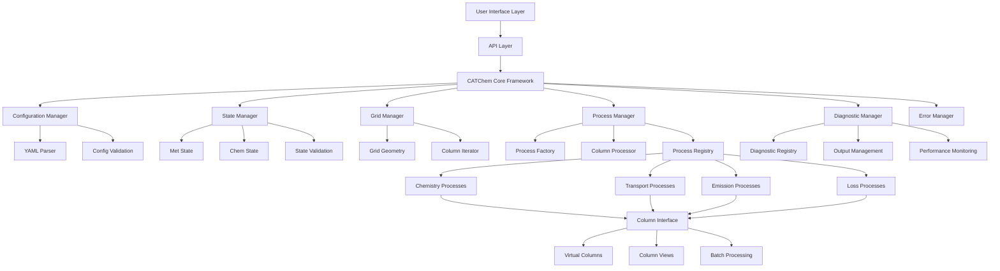

# Developer Architecture Guide

This guide provides a comprehensive overview of CATChem's software architecture, design principles, and implementation patterns for developers working on the codebase.

## Architectural Overview

CATChem follows a modern, modular architecture designed for:

- **Maintainability**: Clear separation of concerns and well-defined interfaces
- **Extensibility**: Easy addition of new processes and capabilities
- **Performance**: Efficient computation and memory usage patterns
- **Testability**: Comprehensive unit and integration testing support
- **Portability**: Cross-platform compatibility and compiler support

## High-Level Architecture

### System Components



### Layer Responsibilities

#### 1. User Interface Layer
- Command-line interface
- Configuration file processing
- Error reporting and logging
- Integration with host models

#### 2. API Layer
- Public interfaces for external integration
- NUOPC and CCPP compatibility
- C/Python binding support
- Version management and compatibility

#### 3. Core System Layer
- Configuration management and validation
- State container and data flow
- Process management and scheduling
- Column virtualization framework

#### 4. Process Layer
- Individual atmospheric processes
- Numerical schemes and algorithms
- Process interdependencies
- Scientific validation and testing

#### 5. Infrastructure Layer
- Diagnostic and monitoring systems
- Performance optimization utilities
- Error handling and recovery
- I/O management and formats

## Design Principles

### 1. Separation of Concerns

Each module has a single, well-defined responsibility:

```fortran
! Configuration is separate from computation
module ConfigManager_Mod
  ! Only handles configuration parsing and validation
end module ConfigManager_Mod

! State management is separate from process logic
module StateInterface_Mod
  ! Only handles data storage and access
end module StateInterface_Mod

! Process logic is separate from infrastructure
module ChemistryProcess_Mod
  ! Only handles chemical calculations
end module ChemistryProcess_Mod
```

### 2. Interface-Based Design

All major components interact through well-defined interfaces:

```fortran
! Abstract process interface
type, abstract :: ProcessInterface_t
contains
  procedure(initialize_interface), deferred :: initialize
  procedure(run_interface), deferred :: run
  procedure(finalize_interface), deferred :: finalize
end type ProcessInterface_t

! Concrete implementations extend the interface
type, extends(ProcessInterface_t) :: ChemistryProcess_t
contains
  procedure :: initialize => chemistry_initialize
  procedure :: run => chemistry_run
  procedure :: finalize => chemistry_finalize
end type ChemistryProcess_t
```

### 3. Dependency Injection

Components receive their dependencies rather than creating them:

```fortran
! Process receives its dependencies at initialization
subroutine chemistry_initialize(this, config, state, diagnostics, rc)
  class(ChemistryProcess_t), intent(inout) :: this
  type(Configuration_t), intent(in) :: config           ! Injected
  type(StateInterface_t), intent(inout) :: state        ! Injected
  type(DiagnosticInterface_t), intent(inout) :: diagnostics ! Injected
  type(ErrorCode_t), intent(out) :: rc
```

### 4. Immutable Configuration

Configuration objects are read-only after initialization:

```fortran
type :: Configuration_t
  private
  type(ConfigurationData_t) :: data
contains
  procedure :: get_value => config_get_value  ! Read-only access
  ! No public setters - configuration is immutable
end type Configuration_t
```

## Core Architecture Components

### CATChem Core Framework

```fortran
module CATChemCore_Mod
  ! Central CATChem core that owns and manages all major components
  type :: CATChemCoreType
    type(ConfigManagerType) :: config_manager
    type(StateManagerType) :: state_manager
    type(GridManagerType) :: grid_manager
    type(DiagnosticManagerType) :: diagnostic_manager
    type(ProcessManagerType) :: process_manager
    type(ErrorManagerType) :: error_manager
  contains
    procedure :: init => core_init
    procedure :: run_timestep => core_run_timestep
    procedure :: finalize => core_finalize
    procedure :: get_state_manager => core_get_state_manager
    procedure :: get_diagnostic_manager => core_get_diagnostic_manager
  end type CATChemCoreType
```

### Configuration Management

```fortran
module ConfigManager_Mod
  ! Enhanced configuration management with YAML support
  type :: ConfigManagerType
    type(ConfigDataType) :: config_data
    type(ErrorManagerType), pointer :: error_manager
    character(len=:), allocatable :: config_file_path
    logical :: is_initialized = .false.
  contains
    procedure :: init => config_manager_init
    procedure :: load_from_file => config_manager_load_from_file
    procedure :: validate_config => config_manager_validate_config
    procedure :: apply_to_container => config_manager_apply_to_container
    procedure :: get_config_data => config_manager_get_config_data
  end type ConfigManagerType
```

### State Management

```fortran
module StateManager_Mod
  ! Unified state management for all CATChem data
  type :: StateManagerType
    type(MetStateType) :: met_state
    type(ChemStateType) :: chem_state
    type(StateValidatorUtilsType) :: validator
    integer :: status = STATE_STATUS_UNINITIALIZED
  contains
    procedure :: init => state_manager_init
    procedure :: validate_state => state_manager_validate_state
    procedure :: get_met_state => state_manager_get_met_state
    procedure :: get_chem_state => state_manager_get_chem_state
    procedure :: finalize => state_manager_finalize
  end type StateManagerType

  ! State validation utilities
  type :: StateValidatorUtilsType
  contains
    procedure :: validate_met_fields => svu_validate_met_fields
    procedure :: validate_chem_fields => svu_validate_chem_fields
    procedure :: check_physical_consistency => svu_check_physical_consistency
  end type StateValidatorUtilsType
```

### Process Management

```fortran
module ProcessManager_Mod
  ! High-level process management following architecture guide
  type :: ProcessManagerType
    class(ProcessInterface), allocatable :: processes(:)
    integer :: num_processes = 0
    integer :: max_processes = 50
    type(ProcessFactoryType) :: factory
    type(ColumnProcessorType) :: column_processor
  contains
    procedure :: init => manager_init
    procedure :: add_process => manager_add_process
    procedure :: run_all => manager_run_all
    procedure :: run_column_processes => manager_run_column_processes
    procedure :: finalize => manager_finalize
    procedure :: configure_run_phases => manager_configure_run_phases
  end type ProcessManagerType

  ! Process factory for creating process instances
  type :: ProcessFactoryType
  contains
    procedure :: create_process => factory_create_process
    procedure :: register_process_type => factory_register_process_type
  end type ProcessFactoryType
```

### Grid Management

```fortran
module GridManager_Mod
  ! Grid and domain management
  type :: GridManagerType
    type(GridGeometryType) :: geometry
    type(ColumnIteratorType) :: column_iterator
    integer :: total_columns
  contains
    procedure :: init => grid_manager_init
    procedure :: get_column_iterator => grid_manager_get_column_iterator
    procedure :: get_geometry => grid_manager_get_geometry
  end type GridManagerType

  ! Column iteration for parallelization
  type :: ColumnIteratorType
    integer :: current_column = 0
    integer :: total_columns = 0
  contains
    procedure :: next => column_iterator_next
    procedure :: reset => column_iterator_reset
    procedure :: get_current => column_iterator_get_current
  end type ColumnIteratorType
```

### Diagnostic Management

```fortran
module DiagnosticManager_Mod
  ! Central diagnostic manager
  type :: DiagnosticManagerType
    type(DiagnosticRegistryType) :: registry
    type(ErrorManagerType), pointer :: error_manager
    logical :: is_initialized = .false.
  contains
    procedure :: init => diagnostic_manager_init
    procedure :: register_process_diagnostics => dm_register_process_diagnostics
    procedure :: collect_all_diagnostics => dm_collect_all_diagnostics
    procedure :: write_output => dm_write_output
    procedure :: finalize => diagnostic_manager_finalize
  end type DiagnosticManagerType
```

### Additional Core Modules

#### Species Management

```fortran
module Species_Mod
  ! Chemical species definition and utilities
  type :: SpeciesType
    character(len=:), allocatable :: name
    character(len=:), allocatable :: units
    real(fp) :: molecular_weight
    logical :: is_active
  end type SpeciesType
```

#### Chemical Species Utilities

```fortran
module ChemSpeciesUtils_Mod
  ! Utilities for chemical species handling
  contains
    procedure :: validate_species_data
    procedure :: convert_species_units
    procedure :: check_species_consistency
```

#### Unit Conversion

```fortran
module UnitConversion_Mod
  ! Comprehensive unit conversion utilities
  contains
    procedure :: convert_concentration_units
    procedure :: convert_pressure_units
    procedure :: convert_temperature_units
    procedure :: validate_unit_compatibility
```

#### Meteorological Utilities

```fortran
module Met_Utilities_Mod
  ! Meteorological data processing utilities
  contains
    procedure :: interpolate_met_data
    procedure :: calculate_air_density
    procedure :: compute_scale_heights
    procedure :: validate_met_consistency
```

#### External Emission Data

```fortran
module ExtEmisData_Mod
  ! External emission data management
  type :: ExtEmisDataType
    real(fp), allocatable :: emission_rates(:,:,:,:)
    character(len=:), allocatable :: species_names(:)
    logical :: is_initialized = .false.
  contains
    procedure :: load_emission_data
    procedure :: interpolate_emissions
    procedure :: validate_emission_data
  end type ExtEmisDataType
```

#### Time State Management

```fortran
module TimeState_Mod
  ! Time state and temporal processing
  type :: TimeStateType
    integer :: current_year
    integer :: current_month
    integer :: current_day
    integer :: current_hour
    real(fp) :: time_step_seconds
  contains
    procedure :: advance_time
    procedure :: get_current_time
    procedure :: validate_time_step
  end type TimeStateType
```

## Column Virtualization Architecture

### Design Philosophy

Column virtualization transforms 3D atmospheric modeling into efficient 1D processing:

```fortran
! Column-based processing (efficient)
!$OMP PARALLEL DO PRIVATE(column_data)
do col = 1, num_columns
  call extract_column(state_container, col, column_data)
  call process_column(column_data, ...)
  call update_column(state_container, col, column_data)
end do
!$OMP END PARALLEL DO
```

### Column Interface Implementation

```fortran
module ColumnInterface_Mod
  ! Virtual column interface for multi-dimensional data
  type :: VirtualColumnType
    real(fp), pointer :: temperature(:) => null()
    real(fp), pointer :: pressure(:) => null()
    real(fp), pointer :: species(:,:) => null()
    integer :: column_index
    integer :: num_levels
  contains
    procedure :: extract_from_state => vc_extract_from_state
    procedure :: update_state => vc_update_state
    procedure :: is_valid => vc_is_valid
  end type VirtualColumnType

  ! Column processor for batch operations
  type :: ColumnProcessorType
    integer :: batch_size = 1000
    logical :: use_openmp = .true.
  contains
    procedure :: process_batch => cp_process_batch
    procedure :: set_batch_size => cp_set_batch_size
    procedure :: enable_openmp => cp_enable_openmp
  end type ColumnProcessorType

  ! Column view for zero-copy access
  type :: ColumnViewType
    class(*), pointer :: data_ptr => null()
    integer :: dimensions(3)
    integer :: column_index
  contains
    procedure :: create_view => cv_create_view
    procedure :: get_column_pointer => cv_get_column_pointer
  end type ColumnViewType
  end do
end do

! Column virtualization (efficient)
do col = 1, num_columns
  ! Process entire column at once
  call process_column(column_data(col), ...)
end do
```

### Column Data Structure

```fortran
type :: ColumnData_t
  ! Spatial information
  real(r8) :: longitude, latitude
  integer :: global_i, global_j
  integer :: num_levels

  ! Atmospheric state
  real(r8), allocatable :: species_concentrations(:,:)  ! (species, levels)
  real(r8), allocatable :: temperature(:)               ! (levels)
  real(r8), allocatable :: pressure(:)                  ! (levels)
  real(r8), allocatable :: density(:)                   ! (levels)

  ! Surface properties
  real(r8) :: surface_pressure
  real(r8) :: surface_temperature
  type(SurfaceProperties_t) :: surface

  ! Process-specific workspace
  type(ProcessWorkspace_t), allocatable :: workspace(:)
```

### Column Processing Framework

```fortran
module ColumnVirtualization_Mod

  type :: ColumnVirtualization_t
    integer :: num_columns
    type(ColumnData_t), allocatable :: columns(:)
    type(ColumnMapper_t) :: mapper
  contains
    procedure :: initialize => cv_initialize
    procedure :: map_from_3d => cv_map_from_3d
    procedure :: map_to_3d => cv_map_to_3d
    procedure :: process_columns => cv_process_columns
  end type ColumnVirtualization_t

  ! Efficient column processing with parallelization
  subroutine cv_process_columns(this, process_kernel, time_step, rc)
    class(ColumnVirtualization_t), intent(inout) :: this
    procedure(column_process_interface) :: process_kernel
    real(r8), intent(in) :: time_step
    type(ErrorCode_t), intent(out) :: rc

    integer :: col

    !$OMP PARALLEL DO PRIVATE(col) SCHEDULE(DYNAMIC)
    do col = 1, this%num_columns
      call process_kernel(this%columns(col), time_step, rc)
      if (rc%is_error()) then
        !$OMP CRITICAL
        call handle_column_error(col, rc)
        !$OMP END CRITICAL
      end if
    end do
    !$OMP END PARALLEL DO
  end subroutine cv_process_columns
```

## Error Handling Architecture

### Error Code System

```fortran
module ErrorHandling_Mod

  ! Comprehensive error information
  type :: ErrorCode_t
    integer :: code = 0
    character(len=:), allocatable :: message
    character(len=:), allocatable :: context(:)
    logical :: is_recoverable = .false.
  contains
    procedure :: set_success => ec_set_success
    procedure :: set_error => ec_set_error
    procedure :: set_warning => ec_set_warning
    procedure :: add_context => ec_add_context
    procedure :: is_error => ec_is_error
    procedure :: is_success => ec_is_success
  end type ErrorCode_t

  ! Error handling patterns
  interface
    subroutine error_handler_interface(error_code, recovery_action)
      import :: ErrorCode_t
      type(ErrorCode_t), intent(in) :: error_code
      character(len=*), intent(out) :: recovery_action
    end subroutine error_handler_interface
  end interface
```

### Error Recovery Strategies

```fortran
! Graceful degradation example
subroutine robust_chemistry_solve(this, column_data, time_step, rc)
  class(ChemistryProcess_t), intent(inout) :: this
  type(ColumnData_t), intent(inout) :: column_data
  real(r8), intent(in) :: time_step
  type(ErrorCode_t), intent(out) :: rc

  type(ErrorCode_t) :: local_rc
  real(r8) :: reduced_timestep

  ! Try normal integration
  call this%solve_chemistry(column_data, time_step, local_rc)

  if (local_rc%is_error() .and. local_rc%is_recoverable()) then
    ! Try with reduced timestep
    reduced_timestep = time_step * 0.1_r8
    call this%solve_chemistry_subcycling(column_data, reduced_timestep, &
                                        int(time_step/reduced_timestep), local_rc)

    if (local_rc%is_success()) then
      call rc%set_warning("Used subcycling for numerical stability")
      return
    end if
  end if

  if (local_rc%is_error()) then
    ! Use fallback scheme
    call this%solve_chemistry_fallback(column_data, time_step, local_rc)
    if (local_rc%is_success()) then
      call rc%set_warning("Used fallback chemistry scheme")
      return
    end if
  end if

  ! If all recovery attempts fail
  call rc%set_error("Chemistry solution failed: " // local_rc%get_message())
end subroutine robust_chemistry_solve
```

## Performance Architecture

### Memory Management

```fortran
module MemoryManager_Mod

  ! Memory pool for efficient allocation
  type :: MemoryPool_t
    real(r8), allocatable :: pool(:)
    integer, allocatable :: allocation_map(:)
    integer :: pool_size, next_free
  contains
    procedure :: allocate_chunk => mp_allocate_chunk
    procedure :: deallocate_chunk => mp_deallocate_chunk
    procedure :: get_statistics => mp_get_statistics
  end type MemoryPool_t

  ! NUMA-aware allocation
  type :: NUMAAllocator_t
    type(MemoryPool_t), allocatable :: pools_per_node(:)
    integer :: num_numa_nodes
  contains
    procedure :: allocate_on_node => na_allocate_on_node
    procedure :: get_local_node => na_get_local_node
  end type NUMAAllocator_t
```

### Computational Kernels

```fortran
! Optimized computational kernels
module ComputationalKernels_Mod

  ! Vectorized operations
  interface vectorized_operation
    module procedure vector_add_r8, vector_multiply_r8, vector_solve_r8
  end interface vectorized_operation

  ! SIMD-optimized vector operations
  pure subroutine vector_add_r8(a, b, result, n)
    integer, intent(in) :: n
    real(r8), intent(in) :: a(n), b(n)
    real(r8), intent(out) :: result(n)

    integer :: i

    !$OMP SIMD
    do i = 1, n
      result(i) = a(i) + b(i)
    end do
    !$OMP END SIMD
  end subroutine vector_add_r8
```

## Testing Architecture

### Test Framework

```fortran
module TestFramework_Mod

  ! Test suite management
  type :: TestSuite_t
    character(len=:), allocatable :: name
    type(TestCase_t), allocatable :: test_cases(:)
    integer :: num_tests, num_passed, num_failed
  contains
    procedure :: add_test => ts_add_test
    procedure :: run_tests => ts_run_tests
    procedure :: generate_report => ts_generate_report
  end type TestSuite_t

  ! Individual test case
  type :: TestCase_t
    character(len=:), allocatable :: name
    procedure(test_procedure_interface), pointer :: test_proc
    logical :: passed = .false.
    character(len=:), allocatable :: failure_message
  contains
    procedure :: run => tc_run
    procedure :: assert_equal => tc_assert_equal
    procedure :: assert_near => tc_assert_near
  end type TestCase_t
```

### Test Categories

```fortran
! Unit tests for individual components
module UnitTests_Mod
  procedure :: test_configuration_loading
  procedure :: test_state_management
  procedure :: test_column_virtualization
  procedure :: test_process_execution
end module UnitTests_Mod

! Integration tests for component interactions
module IntegrationTests_Mod
  procedure :: test_full_process_chain
  procedure :: test_nuopc_integration
  procedure :: test_error_handling
end module IntegrationTests_Mod

! Performance tests for optimization validation
module PerformanceTests_Mod
  procedure :: test_column_processing_speed
  procedure :: test_memory_usage
  procedure :: test_parallel_scalability
end module PerformanceTests_Mod
```

## Documentation Architecture

### Code Documentation Standards

```fortran
!> @brief Brief description of the subroutine
!> @details Detailed description of the algorithm, assumptions, and usage
!> @param[in] input_param Description of input parameter
!> @param[out] output_param Description of output parameter
!> @param[inout] inout_param Description of input/output parameter
!> @return Description of return value
!> @author Developer Name
!> @date Creation date
!> @version Version information
!> @see Related procedures or documentation
!> @warning Important warnings or limitations
!> @note Additional notes or implementation details
subroutine well_documented_procedure(input_param, output_param, inout_param)
  integer, intent(in) :: input_param
  real(r8), intent(out) :: output_param
  type(SomeType_t), intent(inout) :: inout_param
```

### API Documentation

```fortran
!> @defgroup api_core Core API
!> Core functionality for CATChem integration
!> @{

!> @brief Initialize CATChem instance
!> @details This function initializes a CATChem instance with the provided
!> configuration. The instance must be initialized before any other operations.
!> @param[out] instance CATChem instance handle
!> @param[in] config_file Path to configuration file
!> @return Status code (0 = success, non-zero = error)
integer function catchem_initialize(instance, config_file) result(status)
  type(CATChemAPI_t), intent(out) :: instance
  character(len=*), intent(in) :: config_file
end function catchem_initialize

!> @}
```

## Future Architecture Considerations

### Extensibility Points

1. **Plugin Architecture**: Dynamic loading of new processes
2. **GPU Acceleration**: CUDA/OpenCL integration points
3. **Machine Learning**: AI/ML algorithm integration
4. **Cloud Computing**: Containerization and orchestration
5. **Data Formats**: Support for new I/O formats

### Scalability Roadmap

1. **Hybrid Parallelization**: MPI + OpenMP + GPU
2. **Asynchronous Processing**: Overlap computation and communication
3. **Dynamic Load Balancing**: Adaptive work distribution
4. **Memory Hierarchy**: Cache-aware algorithms
5. **Exascale Computing**: Preparation for next-generation HPC

## Related Documentation

- [Build System](core/build-system.md)
- [Process Architecture](processes/architecture.md)
- [State Management](core/state-management.md)
- [Column Virtualization](../user-guide/advanced_topics/column-virtualization.md)
- [Performance Guide](performance.md)

---

*This architecture guide provides the foundation for understanding CATChem's design and implementation. For specific implementation details, consult the individual component documentation.*
