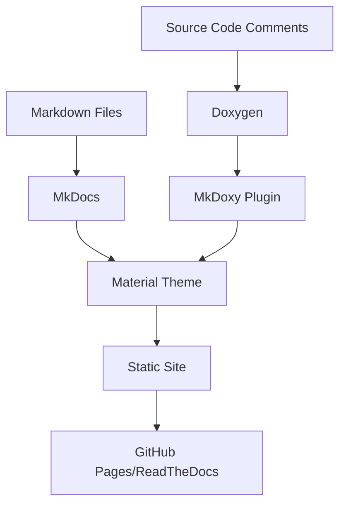
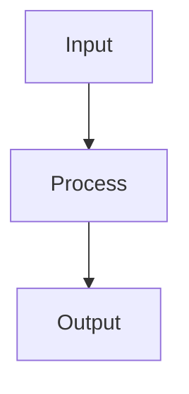

# Documentation Guide

This guide covers the documentation system used in CATChem, including how to write, build, and maintain project documentation.

!!! info "CATChem Documentation System"
    CATChem uses a modern documentation stack with MkDocs, Material theme, and automated API documentation generation to provide comprehensive, accessible documentation for users and developers.

## 📚 Documentation Architecture

### Documentation Stack



**Core Components:**

- **[MkDocs](https://www.mkdocs.org/)** - Static site generator for project documentation
- **[Material Theme](https://squidfunk.github.io/mkdocs-material/)** - Modern, responsive documentation theme
- **[MkDoxy](https://mkdoxy.kubaandrysek.cz/)** - Automatic API documentation from Doxygen
- **[Doxygen](https://www.doxygen.nl/)** - API documentation extraction from Fortran source code

### Documentation Structure

```
docs/
├── index.md                  # Main landing page
├── user-guide/               # End-user documentation
├── processes/                # Process-specific documentation used in the user-guide
├── developer-guide/          # Technical documentation for developers
├── api/                      # API reference
├── ufschem/                  # How CATChem is integrated into the UFS to create UFS-Chem
├── community/                # How to get involved?
├── evaluation/               # How CATChem and UFS-Chem are evaluated
├── assets/                   # Images, stylesheets, scripts
└── ../mkdocs.yml             # Documentation configuration
```

## ✏️ Writing Documentation

### Markdown Standards

CATChem follows the **[CommonMark](https://commonmark.org/)** specification with Material theme extensions:

~~~markdown
# Document Title

Brief introduction with context and purpose.

!!! note "Information Callout"
    Use admonitions for important information, tips, and warnings.

## Section Heading

### Subsection

Content with **bold**, *italic*, `code`, and [links](../other-doc.md).

```python
# Code blocks with syntax highlighting
def example_function():
    return "Hello, CATChem!"
```

| Column 1 | Column 2 | Column 3 |
|----------|----------|----------|
| Data 1   | Data 2   | Data 3   |

=== "Tab 1"
    Content for tab 1

=== "Tab 2"
    Content for tab 2
~~~

### Material Theme Features

**Admonitions:**
```markdown
!!! note "Title"
    Note content

!!! tip "Pro Tip"
    Helpful advice

!!! warning "Important"
    Warning information

!!! danger "Critical"
    Critical warnings
```

**Code Annotations:**
~~~markdown
```python title="example.py"
def function_name():  # (1)!
    return "value"    # (2)!
```

1. Function definition
2. Return statement
~~~

**Tabbed Content:**
~~~markdown
=== "Linux"
    ```bash
    ./configure --prefix=/usr/local
    ```

=== "macOS"
    ```bash
    ./configure --prefix=/opt/local
    ```
~~~

### Fortran API Documentation

CATChem uses Doxygen-style comments in Fortran source code:

```fortran
!> @brief Brief description of the module/subroutine
!>
!> Detailed description explaining the purpose, behavior,
!> and usage of this component.
!>
!> @param[in] input_param Description of input parameter
!> @param[out] output_param Description of output parameter
!> @param[inout] inout_param Description of input/output parameter
!>
!> @return Description of return value (if applicable)
!>
!> @note Additional notes or implementation details
!> @warning Important warnings or limitations
!>
!> Example usage:
!> @code{.f90}
!> call example_subroutine(input_value, output_value, rc)
!> @endcode
subroutine example_subroutine(input_param, output_param, rc)
```

**Doxygen Tags:**

- `@brief` - Short description
- `@param[in|out|inout]` - Parameter documentation
- `@return` - Return value description
- `@note` - Additional notes
- `@warning` - Important warnings
- `@see` - Cross-references
- `@code{.f90}` / `@endcode` - Code examples

## 🔧 Building Documentation

### Local Development

**Install Dependencies:**
```bash
# Create conda environment
conda env create -f docs/environment-docs.yml
conda activate catchem-docs

# Or use pip
pip install -r docs/requirements.txt
```

**Build and Serve:**
```bash
# Serve with live reload (recommended for development)
mkdocs serve

# Build static site
mkdocs build

# Build with API documentation (slower)
mkdocs build --config-file mkdocs.yml
```

**Development Workflow:**
```bash
# Start development server
mkdocs serve --dev-addr=0.0.0.0:8000

# Open browser to http://localhost:8000
# Edit markdown files - changes auto-reload
```

### Build Configuration

**MkDocs Configuration (`mkdocs.yml`):**
```yaml
site_name: CATChem Documentation
site_description: Community Atmospheric Transport Chemistry Model
theme:
  name: material
  features:
    - navigation.tabs
    - navigation.sections
    - content.code.copy
    - search.highlight

plugins:
  - search
  - mkdoxy:
      projects:
        CATChem:
          src-dirs: src
          doxy-cfg:
            FILE_PATTERNS: "*.F90 *.f90"
            OPTIMIZE_FOR_FORTRAN: true

nav:
  - Home: index.md
  - User Guide: user-guide/
  - Developer Guide: developer-guide/
```

### Continuous Integration

**GitHub Actions (`.github/workflows/docs.yml`):**
```yaml
name: Documentation

on:
  push:
    branches: [main, develop]
    paths: ['docs/**', 'src/**/*.F90', 'mkdocs.yml']
  pull_request:
    paths: ['docs/**', 'src/**/*.F90', 'mkdocs.yml']

jobs:
  build:
    runs-on: ubuntu-latest
    steps:
      - uses: actions/checkout@v4
      - uses: actions/setup-python@v4
        with:
          python-version: '3.11'
      - name: Install dependencies
        run: pip install -r docs/requirements.txt
      - name: Build documentation
        run: mkdocs build --strict
      - name: Deploy to GitHub Pages
        if: github.ref == 'refs/heads/main'
        run: mkdocs gh-deploy --force
```

## 📝 Documentation Types

### User Documentation

- **Purpose:** Enable users to effectively use CATChem
- **Audience:** Researchers, operational forecasters, students
- **Location:** `docs/user-guide/`

**Content Guidelines:**

- Task-oriented organization
- Step-by-step procedures
- Real-world examples
- Troubleshooting guides
- Performance tips
- Build system details
- Advanced topics section providing greater detail

**Example Structure:**
```markdown
# Running CATChem

This guide covers how to run CATChem simulations.

## Prerequisites

Before running CATChem, ensure you have:
- [ ] Compiled CATChem successfully
- [ ] Prepared input files
- [ ] Configured your case

## Basic Usage

1. **Prepare Configuration**
   ```yaml
   model:
     start_time: "2024-01-01T00:00:00"
     end_time: "2024-01-02T00:00:00"
   ```

2. **Run Simulation**
   ```bash
   ./catchem_driver --config config.yml
   ```

## Advanced Options

### Parallel Execution
...
```

### Developer Documentation

- **Purpose:** Enable developers to contribute to CATChem
- **Audience:** Software developers, model developers, contributors
- **Location:** `docs/developer-guide/`

**Content Guidelines:**

- Architecture explanations
- Code patterns and conventions
- API documentation
- Testing strategies

**Example Structure:**
~~~markdown
# Process Architecture

CATChem uses a modular process architecture for atmospheric chemistry components.

## Design Principles

1. **Separation of Concerns** - Clear boundaries between components
2. **Testability** - Each process can be tested independently
3. **Extensibility** - Easy to add new processes

## Process Interface

All processes implement the `ProcessInterface_Mod`:

```fortran
type, abstract :: ProcessInterface_t
contains
  procedure(initialize_interface), deferred :: initialize
  procedure(run_interface), deferred :: run
  procedure(finalize_interface), deferred :: finalize
end type
```
~~~

### API Documentation

- **Purpose:** Comprehensive reference for all modules and procedures
- **Audience:** Developers integrating with CATChem
- **Location:** `docs/api/` (auto-generated)

**Auto-generated from source code using Doxygen:**

- Module documentation
- Type definitions
- Procedure signatures
- Parameter descriptions
- Usage examples

## 🎯 Documentation Standards

### Writing Style

**Clarity and Conciseness:**

- Use active voice
- Write clear, concise sentences
- Use consistent terminology
- Define technical terms

**Structure:**

- Use descriptive headings
- Organize content logically
- Include table of contents for long documents
- Use bullet points and numbered lists

**Code Examples:**

- Provide complete, runnable examples
- Use realistic data and scenarios
- Include expected output
- Comment complex code

### Cross-References

**Internal Links:**
```markdown
See the [Build System Guide](build-system.md) for compilation details.
```

**External Links:**
```markdown
Refer to the [MkDocs documentation](https://www.mkdocs.org/) for more information.
```

**API References:**
```markdown
The `StateContainer` is documented in the [API reference](../api/CATChem/state_mod.md).
```

### Images and Diagrams

**Formats:**

- Use PNG for screenshots and complex diagrams
- Use SVG for simple diagrams (if Pandoc compatibility not required)
- Use Mermaid for flow charts and system diagrams

**Placement:**
```markdown

*Figure 1: CATChem system architecture*
```

**Mermaid Diagrams:**


## 🚀 Advanced Features

### Search Optimization

**Search Configuration:**
```yaml
plugins:
  - search:
      separator: '[\s\-,:!=\[\]()"`/]+|\.(?!\d)|&[lg]t;|(?!\b)(?=[A-Z][a-z])'
      lang: en
      min_search_length: 2
```

**SEO Optimization:**

- Descriptive page titles
- Meta descriptions
- Structured headings
- Alt text for images

### Version Management

**Multi-version Documentation:**
```bash
# Deploy version
mike deploy --push --update-aliases 1.0 latest

# List versions
mike list

# Set default version
mike set-default --push latest
```

### Analytics and Monitoring

**Google Analytics Integration:**
```yaml
extra:
  analytics:
    provider: google
    property: G-XXXXXXXXXX
```

**Performance Monitoring:**

- Page load times
- Search usage
- Popular content
- User flows

## 🔍 Quality Assurance

### Review Process

**Documentation Review Checklist:**

- [x] Technical accuracy verified
- [x] Links tested and working
- [x] Code examples tested
- [x] Spelling and grammar checked
- [x] Consistent style and formatting
- [x] Cross-references updated
- [x] Screenshots current

### Automated Checks

**Link Checking:**
```bash
# Install linkchecker
pip install linkchecker

# Check built documentation
linkchecker _site/
```

**Spell Checking:**
```bash
# Install cspell
npm install -g cspell

# Check documentation
cspell "docs/**/*.md"
```

### Accessibility

**Accessibility Guidelines:**

- Use descriptive link text
- Provide alt text for images
- Use proper heading hierarchy
- Ensure sufficient color contrast
- Test with screen readers

## 📊 Documentation Metrics

### Tracking Success

**Key Metrics:**

- Documentation coverage
- User engagement
- Search success rate
- Issue resolution time

**Coverage Analysis:**
```bash
# Count documented vs undocumented procedures
grep -r "!>" src/ | wc -l
find src/ -name "*.F90" -exec grep -L "!>" {} \;
```

## 🛠️ Troubleshooting

### Common Issues

**Build Failures:**
```bash
# Clear cache and rebuild
mkdocs build --clean

# Check for missing dependencies
pip install -r docs/requirements.txt
```

**Missing API Documentation:**
```bash
# Verify Doxygen installation
doxygen --version

# Check Doxygen configuration
doxygen -g
```

**Link Errors:**

- Verify file paths are correct
- Check case sensitivity on Unix systems
- Ensure files exist in repository

### Getting Help

**Resources:**

- **[MkDocs Documentation](https://www.mkdocs.org/)**
- **[Material Theme Documentation](https://squidfunk.github.io/mkdocs-material/)**
- **[Doxygen Manual](https://www.doxygen.nl/manual/)**
- **[CATChem Issues](https://github.com/UFS-Community/CATChem/issues)**

**Contact:**

- Development team: **[GitHub Discussions](https://github.com/UFS-Community/CATChem/discussions)**
- Documentation issues: **[GitHub Issues](https://github.com/UFS-Community/CATChem/issues)**

## 📚 Related Resources

- **[Writing Guide](contributing.md#documentation)**
- **[Build System](../user-guide/build-system.md)**
- **[Testing Documentation](testing.md#documentation-testing)**
- **[API Standards](coding-standards.md#documentation)**

---

*This documentation guide is maintained by the CATChem development team. For questions or suggestions, please open an issue on GitHub.*
