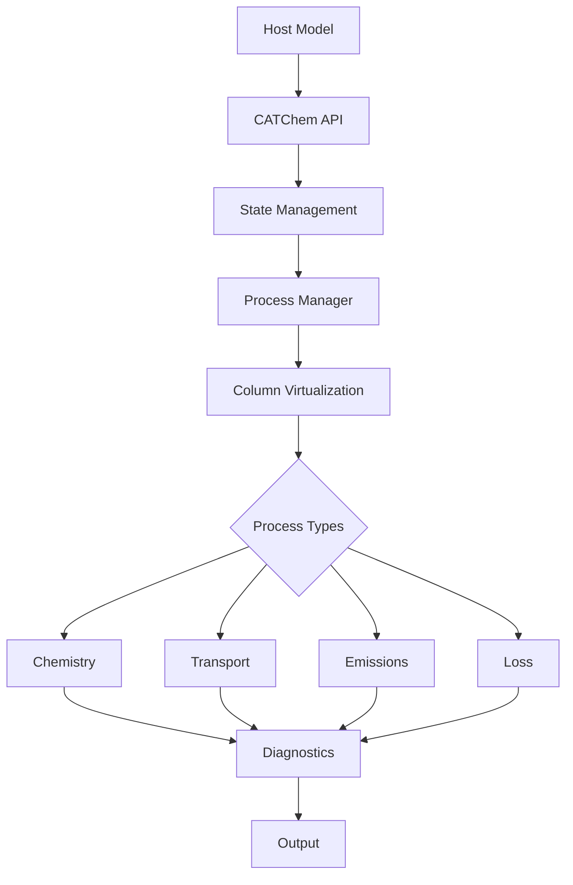

# Developer Guide

Welcome to the CATChem Developer Guide! This comprehensive guide covers everything you need to know to develop, modify, and extend CATChem.

## Overview

CATChem is designed with modern software engineering principles:

- **Modular Architecture**: Clean separation between processes, I/O, and state management
- **Column Virtualization**: High-performance 1D processing with automatic parallelization
- **Modern Fortran**: Leverages Fortran 2008+ features for safety and performance
- **Comprehensive Testing**: Unit tests, integration tests, and validation benchmarks
- **Documentation-Driven**: Extensive documentation and clear APIs

## Quick Navigation

<div class="grid cards" markdown>

- [:material-puzzle: **Process Development**](processes/index.md)

  ---

  Create new atmospheric processes and schemes

- [:material-cog: **Core Systems**](core/index.md)

  ---

  Understand state management, diagnostics, and infrastructure

- [:material-merge: **Integration**](integration/index.md)

  ---

  Integrate CATChem with host models (FV3, CCPP, NUOPC)

- [:material-test-tube: **Testing**](testing.md)

  ---

  Testing framework, validation, and quality assurance

</div>

## Architecture Overview



### Key Design Principles

1. **Separation of Concerns**
   - Host model handles I/O and grid management
   - CATChem focuses on atmospheric chemistry and transport
   - Clear interfaces between components

2. **Column Virtualization**
   - Default processing mode for optimal performance
   - Automatic load balancing and memory optimization
   - Maintains physical correctness while improving efficiency

3. **Process-Based Architecture**
   - Each atmospheric process is independent
   - Pluggable schemes within processes
   - Clear dependency management

4. **Modern Error Handling**
   - Context-aware error reporting
   - Structured error codes and messages
   - Graceful degradation and recovery

## Development Workflow

### 1. Setting Up Development Environment

```bash
# Clone with development branches
git clone -b develop https://github.com/NOAA-GSL/CATChem.git
cd CATChem

# Create development build
mkdir build-dev
cd build-dev
cmake -DCMAKE_BUILD_TYPE=Debug \
      -DENABLE_TESTING=ON \
      -DENABLE_COVERAGE=ON \
      -DENABLE_PROFILING=ON \
      ..
make -j$(nproc)
```

### 2. Code Development Cycle

```bash
# Create feature branch
git checkout -b feature/my-new-process

# Develop with continuous testing
make && ctest
make check-style
make check-coverage

# Commit with conventional commits
git commit -m "feat(settling): add slip correction for small particles"

# Push and create pull request
git push origin feature/my-new-process
```

### 3. Documentation

All code must include comprehensive documentation:

```fortran
!> \file MyProcess_Mod.F90
!! \brief Brief description of the process
!! \ingroup process_modules
!!
!! Detailed description of what this process does,
!! including physics, limitations, and usage notes.
!!
!! \author Your Name
!! \date 2025
!! \version 1.0

!> Calculate atmospheric settling velocities
!!
!! This routine computes gravitational settling velocities
!! using Stokes law with slip corrections for small particles.
!!
!! \param[in]  nz           Number of vertical levels
!! \param[in]  temperature  Air temperature [K]
!! \param[out] velocity     Settling velocity [m/s]
!! \param[out] rc           Return code
!!
subroutine calculate_settling_velocity(nz, temperature, velocity, rc)
```

## Key Concepts

### StateContainer Pattern

The StateContainer is the central data management system:

```fortran
type(StateContainerType) :: container

! Access meteorological data
met_state => container%get_met_state_ptr()
temperature => met_state%temperature

! Access chemical data
chem_state => container%get_chem_state_ptr()
concentrations => chem_state%concentrations

! Access configuration
config => container%get_config_ptr()
```

### Process Interface

All processes inherit from `ProcessInterface`:

```fortran
type, extends(ProcessInterface) :: MyProcessType
   ! Process-specific data
contains
   procedure :: init => my_process_init
   procedure :: run => my_process_run
   procedure :: finalize => my_process_finalize
end type
```

### Column Virtualization

Processes can implement column processing for performance:

```fortran
type, extends(ColumnProcessInterface) :: MyProcessType
contains
   procedure :: run_column => my_process_run_column
   procedure :: supports_column_processing => my_process_supports_column
end type
```

### Error Handling

Use structured error handling throughout:

```fortran
use error_mod
type(ErrorManagerType), pointer :: error_mgr

error_mgr => container%get_error_manager()
call error_mgr%push_context('my_routine', 'Calculating settling')

! Operations...
if (some_error_condition) then
   call error_mgr%report_error(ERROR_INVALID_INPUT, &
                              'Temperature must be positive', rc, &
                              'my_routine', &
                              'Check input data validation')
   call error_mgr%pop_context()
   return
endif

call error_mgr%pop_context()
```

## Contributing Guidelines

### Code Standards

1. **Fortran Style**
   - Use modern Fortran (2008+) features
   - Follow the [Fortran Style Guide](coding-standards.md)
   - Use meaningful variable names
   - Include comprehensive comments

2. **Performance**
   - Prefer column processing over 3D processing
   - Use intent declarations correctly
   - Avoid unnecessary allocations
   - Profile performance-critical code

3. **Testing**
   - Write unit tests for all new functionality
   - Include integration tests for processes
   - Validate against analytical solutions where possible
   - Test error conditions and edge cases

### Review Process

1. **Pre-Review Checklist**
   - [ ] Code compiles without warnings
   - [ ] All tests pass
   - [ ] Documentation updated
   - [ ] Style checks pass
   - [ ] Performance regression tests

2. **Code Review**
   - Technical correctness
   - Architecture consistency
   - Performance implications
   - Documentation quality
   - Test coverage

3. **Integration**
   - Continuous Integration (CI) checks
   - Performance benchmarks
   - Documentation build
   - Release notes update

## Tools and Utilities

### Development Tools

- **CMake**: Modern build system with testing integration
- **CTest**: Automated testing framework
- **Doxygen**: API documentation generation
- **lcov**: Code coverage analysis
- **Valgrind**: Memory debugging (when available)
- **Intel VTune**: Performance profiling (Intel systems)

### Code Quality

```bash
# Style checking
make check-style

# Coverage analysis
make coverage
firefox coverage/index.html

# Performance profiling
make profile
gprof ./catchem_test gmon.out > profile.txt
```

### Debugging

```bash
# Debug build
cmake -DCMAKE_BUILD_TYPE=Debug ..

# Run with debugger
gdb ./catchem_test
(gdb) run --config test_config.yml
(gdb) bt  # Backtrace on crash
```

## Advanced Topics

### Performance Optimization

- [Column Virtualization Guide](core/column-virtualization.md)
- [Memory Management Best Practices](performance.md)
- [Profiling and Benchmarking](performance.md#profiling)

### Integration Patterns

- [CCPP Integration](integration/ccpp.md)
- [NUOPC Coupling](integration/nuopc.md)
- [FV3 Integration](integration/fv3.md)

### Extending the Framework

- [Creating New Process Types](processes/creating.md)
- [Adding Diagnostic Variables](core/diagnostics.md)
- [Custom Configuration Options](core/configuration.md)

## Getting Help

### Community Resources

- **GitHub Discussions**: [Technical discussions and Q&A](https://github.com/NOAA-GSL/CATChem/discussions)
- **Issue Tracker**: [Bug reports and feature requests](https://github.com/NOAA-GSL/CATChem/issues)
- **Developer Meetings**: Monthly virtual meetings (contact team for details)

### Internal Resources

- **NOAA GSL Team**: [gsl.help@noaa.gov](mailto:gsl.help@noaa.gov)
- **Architecture Reviews**: Required for major changes
- **Mentorship Program**: Available for new contributors

## Roadmap

### Short Term (6 months)
- Enhanced diagnostic system
- Improved column virtualization
- Additional chemistry mechanisms
- Performance optimizations

### Medium Term (1 year)
- GPU acceleration support
- Advanced parallelization
- Machine learning integration
- Cloud-native deployment

### Long Term (2+ years)
- Exascale computing support
- Real-time data assimilation
- Coupled earth system integration
- Interactive web interfaces

---

Ready to start developing? Check out the [Process Development Guide](processes/index.md) to create your first CATChem process!
