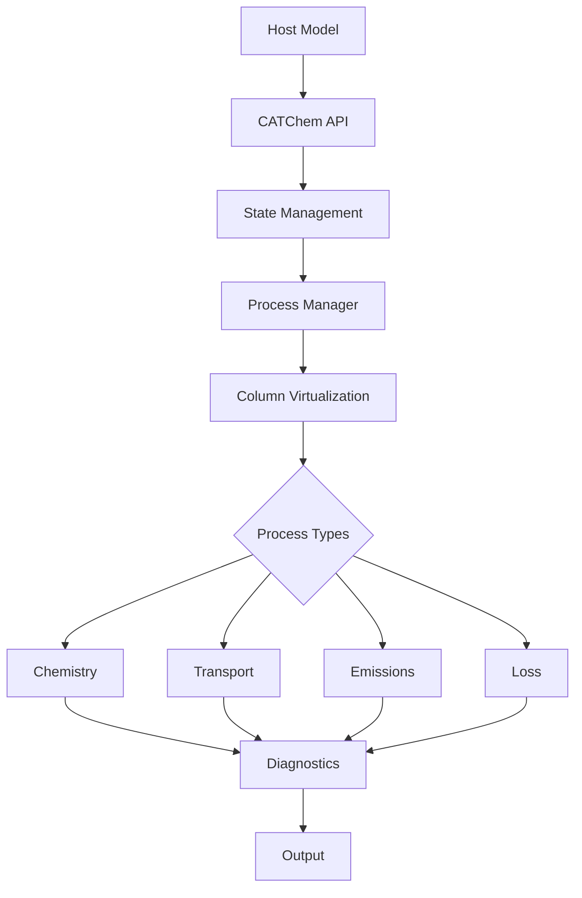

# Developer Guide

Welcome to the CATChem Developer Guide! This comprehensive guide covers everything you need to know to develop, modify, and extend CATChem.

## Overview

CATChem is designed with modern software engineering principles:

- **Modular Architecture**: Clean separation between processes, I/O, and state management
- **Column Virtualization**: High-performance 1D processing with automatic parallelization
- **Modern Fortran**: Leverages Fortran 2008+ features for safety and performance
- **Comprehensive Testing**: Unit tests, integration tests, and validation benchmarks
- **Documentation-Driven**: Extensive documentation and clear APIs

See our [**Contributor Guide**](contributing.md) to learn the basics on how to contribute!

Before getting started, review our [**Coding Standards**](coding-standards.md) to learn how we ensure consistency, maintainability, and performance across the codebase.

## Quick Navigation

<div class="grid cards" markdown>

- [:material-puzzle: **Process Development**](processes/index.md)

  ---

  Create new atmospheric processes and schemes

- [:material-cog: **Core Systems**](core/index.md)

  ---

  Understand state management, diagnostics, and infrastructure

- [:material-merge: **Integration**](integration/index.md)

  ---

  Integrate CATChem with host models (FV3, CCPP, NUOPC)

- [:material-test-tube: **Testing**](testing.md)

  ---

  Testing framework, validation, and quality assurance

- [:material-book-open-variant-outline: **Documentation**](documentation.md)

  ---

  All code includes comprehensive documentation

</div>

## Architecture Overview



Refer to the [**Developer Architecture Guide**](architecture.md) to learn about software architecture, design principles, and implementation patterns for developers

### Key Design Principles

**Separation of Concerns**

   - Host model handles I/O and grid management
   - CATChem focuses on atmospheric chemistry and composition processes
   - Clear interfaces between components

**Column Virtualization**

   - Default processing mode for optimal performance
   - Automatic load balancing and memory optimization
   - Maintains physical correctness while improving efficiency

**Process-Based Architecture**

   - Each atmospheric process is independent
   - Pluggable schemes within processes
   - Clear dependency management

**Modern Error Handling**

   - Context-aware error reporting
   - Structured error codes and messages
   - Graceful degradation and recovery

## Development Workflow

### 1. Setting Up Development Environment

```bash
# Create a fork of the CATChem repository: https://github.com/UFS-Community/CATChem.git
# Clone the develop branch from your fork
git clone -b develop https://github.com/Your-Fork/CATChem.git
cd CATChem

# Create development build
mkdir build-dev
cd build-dev
cmake ..
make -j$(nproc)
```

### 2. Code Development Cycle

```bash
# Create feature branch
git checkout -b feature/my-new-process

# Develop with continuous testing
make && ctest
make check-style
make check-coverage

# Commit with conventional commits
git commit -m "feat(settling): add slip correction for small particles"

# Push and create pull request
git push origin feature/my-new-process
```

### 3. Documentation

All code must include comprehensive documentation:

Documentation updates should be included in the same pull request with your code updates.

```fortran
!> \file MyProcess_Mod.F90
!! \brief Brief description of the process
!! \ingroup process_modules
!!
!! Detailed description of what this process does,
!! including physics, limitations, and usage notes.
!!
!! \author Your Name
!! \date 2025
!! \version 1.0

!> Calculate atmospheric settling velocities
!!
!! This routine computes gravitational settling velocities
!! using Stokes law with slip corrections for small particles.
!!
!! \param[in]  nz           Number of vertical levels
!! \param[in]  temperature  Air temperature [K]
!! \param[out] velocity     Settling velocity [m/s]
!! \param[out] rc           Return code
!!
subroutine calculate_settling_velocity(nz, temperature, velocity, rc)
```
Learn more about contributing to CATChem documentation in the [**Developer Documentation Guide**](documentation.md).

## Key Concepts

### StateContainer Pattern

The StateContainer is the central data management system:

```fortran
type(StateContainerType) :: container

! Access meteorological data
met_state => container%get_met_state_ptr()
temperature => met_state%temperature

! Access chemical data
chem_state => container%get_chem_state_ptr()
concentrations => chem_state%concentrations

! Access configuration
config => container%get_config_ptr()
```

Refer to the [**Developer State Management Guide**](core/state-management.md) to learn more.

### Process Interface

All processes inherit from `ProcessInterface`:

```fortran
type, extends(ProcessInterface) :: MyProcessType
   ! Process-specific data
contains
   procedure :: init => my_process_init
   procedure :: run => my_process_run
   procedure :: finalize => my_process_finalize
end type
```

Refer to the [**Process Development Guide**](processes/index.md) to learn more.

### Column Virtualization

Processes can implement column processing for performance:

```fortran
type, extends(ColumnProcessInterface) :: MyProcessType
contains
   procedure :: run_column => my_process_run_column
   procedure :: supports_column_processing => my_process_supports_column
end type
```


### Error Handling

Use structured error handling throughout:

```fortran
use error_mod
type(ErrorManagerType), pointer :: error_mgr

error_mgr => container%get_error_manager()
call error_mgr%push_context('my_routine', 'Calculating settling')

! Operations...
if (some_error_condition) then
   call error_mgr%report_error(ERROR_INVALID_INPUT, &
                              'Temperature must be positive', rc, &
                              'my_routine', &
                              'Check input data validation')
   call error_mgr%pop_context()
   return
endif

call error_mgr%pop_context()
```

Refer to the [**Developer Error Handling Guide**](core/error-handling.md) to learn more.

Refer to the [**Developer Core Systems Guide**](core/index.md) to learn about more core systems in CATChem.

## Contributing Guidelines

### Code Standards

**Fortran Style**

   - Follow the [**Fortran Style Guide**](coding-standards.md#fortran)
   - Use modern Fortran (2008+) features
   - Use meaningful variable names
   - Include comprehensive comments

**Performance**

   - Follow the [**Performance Guidelines**](coding-standards.md#performance)
   - Prefer column processing over 3D processing
   - Use intent declarations correctly
   - Avoid unnecessary allocations
   - Profile performance-critical code

**Testing**

   - Follow the [**Testing Standards**](coding-standards.md#testing)
   - Write unit tests for all new functionality
   - Include integration tests for processes
   - Validate against analytical solutions where possible
   - Test error conditions and edge cases

Learn more in the [**Developer Coding Standards Guide**](coding-standards.md).

### Review Process

**Pre-Review Checklist**

   - [x] Code compiles without warnings
   - [x] All tests pass
   - [x] Documentation updated
   - [x] Style checks pass
   - [x] Performance regression tests

**Code Review**

   - [x] Technical and scientific correctness
   - [x] Architecture consistency
   - [x] Performance implications
   - [x] Documentation quality
   - [x] Test coverage

**Integration**

   - [x] Continuous Integration (CI) checks
   - [x] Performance benchmarks
   - [x] Documentation build
   - [x] Release notes update

Learn more in the [**Contributor Guide Under Review Process**](contributing.md#review_process).

## Tools and Utilities

### Development Tools

- **CMake**: [**Modern build system**](../user-guide/build-system.md) with testing integration
- **CTest**: Automated testing framework
- **Doxygen**: API documentation generation
- **lcov**: Code coverage analysis
- **Valgrind**: Memory debugging (when available)
- **Intel VTune**: Performance profiling (Intel systems)

### Code Quality

```bash
# Style checking
make check-style

# Coverage analysis
make coverage
firefox coverage/index.html

# Performance profiling
make profile
gprof ./catchem_test gmon.out > profile.txt
```

### Debugging

```bash
# Debug build
cmake -DCMAKE_BUILD_TYPE=Debug ..

# Run with debugger
gdb ./catchem_test
(gdb) run --config test_config.yml
(gdb) bt  # Backtrace on crash
```

## Advanced Topics

### Performance Optimization


- [**Memory Management Best Practices**](performance.md)
- [**Profiling and Benchmarking**](performance.md#profiling)

### [**CATChem Integration Into Host Models**](integration/index.md)

- [**CCPP Integration**](integration/ccpp.md)
- [**NUOPC Coupling**](integration/nuopc.md)
- [**FV3 Integration**](integration/nuopc.md)

### Extending the Framework

- [**Creating New Process Types**](processes/creating.md)
- [**Adding Diagnostic Variables**](core/diagnostics.md)
- [**Custom Configuration Options**](core/configuration.md)
- [**Adding Or Updating Tests**](testing.md)

## Getting Help

### Community Resources

- **GitHub Discussions**: [**Technical discussions and Q&A**](https://github.com/UFS-Community/CATChem/discussions)
- **Issue Tracker**: [**Bug reports and feature requests**](https://github.com/UFS-Community/CATChem/issues)
- **Developer Meetings**: Bi-weekly virtual meetings (contact team for details)
- **Community Meetings**: Bi-monthly virtual meetings (contact team for details)

---

Ready to start developing? Check out the [**Process Development Guide**](processes/index.md) to create your first CATChem process!
