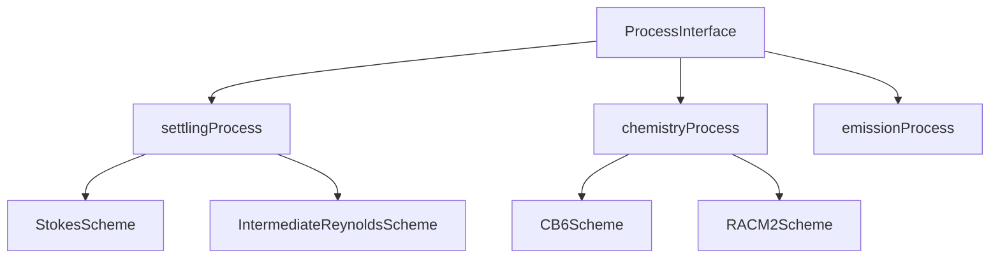

# Process Architecture

CATChem uses a modern, extensible process architecture that enables easy development and integration of atmospheric physics and chemistry processes.

## Overview

The process architecture is built around three key concepts:

1. **ProcessInterface**: Abstract base class defining the standard interface
2. **Process Modules**: Concrete implementations of specific atmospheric processes
3. **Scheme Modules**: Interchangeable algorithmic implementations within processes



## ProcessInterface Base Class

All processes extend the abstract `ProcessInterface` type defined in `ProcessInterface_Mod.F90`:

```fortran
type, abstract :: ProcessInterface
   private
   character(len=64) :: name = ''
   character(len=64) :: version = ''
   character(len=256) :: description = ''
   logical :: is_initialized = .false.
   logical :: is_active = .false.
   real(fp) :: dt = 0.0_fp

   ! Species and size bin management
   integer :: n_species = 0
   character(len=32), allocatable :: species_names(:)
   integer :: n_size_bins = 0
   real(fp), allocatable :: size_bin_bounds(:)

contains
   ! Required interface methods
   procedure(init_interface), deferred :: init
   procedure(run_interface), deferred :: run
   procedure(finalize_interface), deferred :: finalize

   ! Common utility methods
   procedure :: is_ready
   procedure :: get_name
   procedure :: get_version
end type ProcessInterface
```

### Required Methods

Every process must implement three core methods:

#### `init(container, rc)`
- Initialize the process with configuration and state
- Validate inputs and allocate resources
- Set up diagnostic outputs
- Register with the state container

#### `run(container, rc)`
- Execute the main process logic
- Access state data through the container
- Update species concentrations or emissions
- Generate diagnostic output

#### `finalize(rc)`
- Clean up allocated resources
- Close files and finalize diagnostics
- Graceful shutdown procedures

## Process Development Workflow

### 1. Create Process Structure

```bash
# Create process directory
mkdir src/process/myprocess
mkdir src/process/myprocess/schemes

# Create required files
touch src/process/myprocess/myprocessProcess_Mod.F90
touch src/process/myprocess/myprocessCommon_Mod.F90
touch src/process/myprocess/CMakeLists.txt
touch src/process/myprocess/schemes/CMakeLists.txt
```

### 2. Implement Process Module

```fortran
module myprocessProcess_Mod
   use precision_mod
   use state_mod, only : StateContainerType
   use error_mod
   use ProcessInterface_Mod
   use myprocessCommon_Mod

   implicit none
   private

   public :: myprocessProcessType

   type, extends(ProcessInterface) :: myprocessProcessType
      private

      ! Process-specific configuration
      character(len=32) :: selected_scheme = 'default'
      real(fp) :: process_parameter = 1.0_fp

   contains
      procedure :: init => myprocess_init
      procedure :: run => myprocess_run
      procedure :: finalize => myprocess_finalize
   end type myprocessProcessType

contains

   subroutine myprocess_init(this, container, rc)
      class(myprocessProcessType), intent(inout) :: this
      type(StateContainerType), intent(inout) :: container
      integer, intent(out) :: rc

      ! Set process metadata
      this%name = 'myprocess'
      this%version = '1.0'
      this%description = 'My atmospheric process description'

      ! Process-specific initialization
      ! ... implementation details ...

      this%is_initialized = .true.
      this%is_active = .true.
      rc = CC_SUCCESS
   end subroutine myprocess_init

   subroutine myprocess_run(this, container, rc)
      class(myprocessProcessType), intent(inout) :: this
      type(StateContainerType), intent(inout) :: container
      integer, intent(out) :: rc

      ! Get state pointers
      type(MetStateType), pointer :: met_state
      type(ChemStateType), pointer :: chem_state

      met_state => container%get_met_state_ptr()
      chem_state => container%get_chem_state_ptr()

      ! Execute process logic
      ! ... implementation details ...

      rc = CC_SUCCESS
   end subroutine myprocess_run

   subroutine myprocess_finalize(this, rc)
      class(myprocessProcessType), intent(inout) :: this
      integer, intent(out) :: rc

      ! Cleanup resources
      ! ... implementation details ...

      rc = CC_SUCCESS
   end subroutine myprocess_finalize

end module myprocessProcess_Mod
```

### 3. Implement Schemes

Schemes provide interchangeable algorithms within a process:

```fortran
module MyScheme_Mod
   use precision_mod
   use state_mod, only : StateContainerType
   use error_mod

   implicit none
   private

   public :: myscheme_calculate

contains

   subroutine myscheme_calculate(container, parameters, rc)
      type(StateContainerType), intent(inout) :: container
      real(fp), intent(in) :: parameters(:)
      integer, intent(out) :: rc

      ! Scheme-specific calculations
      ! ... implementation details ...

      rc = CC_SUCCESS
   end subroutine myscheme_calculate

end module MyScheme_Mod
```

## State Container Integration

Processes interact with model state through the `StateContainerType`:

### Accessing State Data

```fortran
! Get meteorological state
type(MetStateType), pointer :: met_state
met_state => container%get_met_state_ptr()

! Access temperature, pressure, etc.
real(fp), pointer :: temperature(:,:,:)
temperature => met_state%get_field('temperature')

! Get chemical state
type(ChemStateType), pointer :: chem_state
chem_state => container%get_chem_state_ptr()

! Access species concentrations
real(fp), pointer :: o3_conc(:,:,:)
o3_conc => chem_state%get_species_ptr('O3')
```

### Error Handling

```fortran
type(ErrorManagerType), pointer :: error_mgr
error_mgr => container%get_error_manager()

! Report errors
call error_mgr%report_error("Process calculation failed")

! Report warnings
call error_mgr%report_warning("Using default parameter value")

! Report informational messages
call error_mgr%report_info("Process completed successfully")
```

### Diagnostics

```fortran
type(DiagnosticManagerType), pointer :: diag_mgr
diag_mgr => container%get_diagnostic_manager()

! Register diagnostic variables
call diag_mgr%register_field('settling_velocity', &
                            'Particle settling velocity', &
                            'm/s', shape(settling_vel))

! Update diagnostic values
call diag_mgr%update_field('settling_velocity', settling_vel)
```

## Column Virtualization

CATChem processes operate on 1D columns for optimal performance:

```fortran
subroutine process_column(this, column, rc)
   class(myprocessProcessType), intent(inout) :: this
   type(VirtualColumnType), intent(inout) :: column
   integer, intent(out) :: rc

   ! Process operates on single column
   real(fp) :: temp_profile(column%nz)
   real(fp) :: conc_profile(column%nz, this%n_species)

   ! Get column data
   temp_profile = column%get_met_field('temperature')
   conc_profile = column%get_chem_concentrations()

   ! Process calculations on 1D profiles
   ! ... calculations ...

   ! Update column data
   call column%set_chem_concentrations(conc_profile)

   rc = CC_SUCCESS
end subroutine process_column
```

## Configuration Integration

Processes are configured through YAML files:

```yaml
processes:
  - name: myprocess
    enabled: true
    scheme: MyScheme
    timestep: 60.0
    parameters:
      process_parameter: 2.5
      enable_diagnostics: true
    diagnostics:
      - name: process_rate
        output_frequency: hourly
      - name: process_flux
        output_frequency: daily
```

## Testing and Validation

### Unit Testing

Create unit tests for individual process components:

```fortran
program test_myprocess
   use myprocessProcess_Mod
   use testing_mod

   type(myprocessProcessType) :: process
   type(StateContainerType) :: container
   integer :: rc

   ! Test initialization
   call process%init(container, rc)
   call assert_equal(rc, CC_SUCCESS, "Process initialization failed")

   ! Test calculation
   call process%run(container, rc)
   call assert_equal(rc, CC_SUCCESS, "Process run failed")

   ! Verify results
   ! ... test assertions ...

end program test_myprocess
```

### Integration Testing

Test process integration with the full model:

```fortran
! Create test configuration
call create_test_state_container(container)

! Initialize and run process
call process%init(container, rc)
call process%run(container, rc)

! Validate conservation laws
call validate_mass_conservation(container)
call validate_energy_conservation(container)
```

## Performance Considerations

### Memory Management

- Use pointer associations for large arrays
- Avoid unnecessary allocations in run() method
- Clean up temporary arrays in finalize()

### Computational Efficiency

- Vectorize inner loops where possible
- Minimize conditional branches in tight loops
- Use compiler optimization flags

### Parallel Scalability

- Design for column-parallel execution
- Avoid global reductions where possible
- Use thread-safe operations only

## Best Practices

1. **Keep processes focused**: Each process should handle one physical phenomenon
2. **Use descriptive names**: Process and variable names should be self-documenting
3. **Validate inputs**: Always check state data consistency in init()
4. **Handle errors gracefully**: Use the error manager for all error reporting
5. **Document thoroughly**: Include Doxygen comments for all public interfaces
6. **Test extensively**: Write unit tests for all major functionality
7. **Follow naming conventions**: Use consistent naming patterns across processes

## Example: Settling Process

The settling process demonstrates best practices:

- **Clear interface**: Extends ProcessInterface with required methods
- **Multiple schemes**: Supports Stokes and intermediate Reynolds number schemes
- **Comprehensive diagnostics**: Outputs settling velocity and particle flux
- **Error handling**: Validates inputs and reports meaningful errors
- **Column processing**: Optimized for 1D column calculations

See the [Creating New Processes](creating.md) guide for step-by-step instructions on developing your own process modules.
