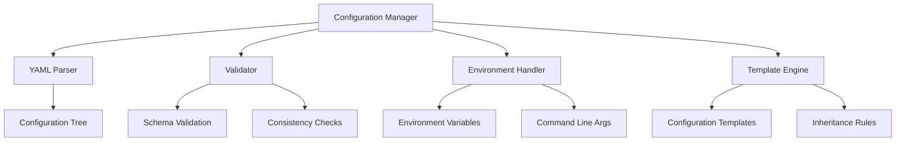

# Configuration Management Guide

This guide provides comprehensive documentation for CATChem's configuration management system, covering YAML-based configuration, runtime modifications, validation, and best practices.

## Overview

CATChem's configuration management system provides:

- **YAML-based Configuration**: Human-readable, hierarchical configuration files
- **Runtime Flexibility**: Dynamic configuration updates without recompilation
- **Validation Framework**: Comprehensive configuration validation and error checking
- **Environment Integration**: Environment variable and command-line integration
- **Configuration Inheritance**: Template-based and hierarchical configurations
- **Version Management**: Configuration versioning and migration support

## Configuration Architecture

### Core Components



### Configuration Interface

```fortran
module ConfigManager_Mod
  use precision_mod
  use error_mod
  use qfyaml_mod

  implicit none

  type :: ConfigManager_t
    type(ConfigurationTree_t) :: config_tree
    type(ConfigValidator_t) :: validator
    type(EnvironmentHandler_t) :: env_handler
    character(len=:), allocatable :: config_file
  contains
    procedure :: initialize => cm_initialize
    procedure :: load_config => cm_load_config
    procedure :: get_value => cm_get_value
    procedure :: set_value => cm_set_value
    procedure :: validate => cm_validate
    procedure :: save_config => cm_save_config
  end type ConfigManager_t
```

## Configuration File Structure

### Basic Structure

```yaml
# CATChem Configuration File
catchem:
  version: "2.1.0"
  run_name: "test_simulation"
  description: "Basic atmospheric chemistry simulation"

  # Time configuration
  time:
    start_date: "2023-01-01T00:00:00"
    end_date: "2023-01-02T00:00:00"
    timestep: 3600  # seconds

  # Domain configuration
  domain:
    grid_type: "regular_latlon"
    dimensions:
      longitude: 180
      latitude: 90
      levels: 47
    resolution:
      horizontal: 1.0  # degrees
      vertical: "hybrid_sigma"

  # I/O configuration
  input:
    meteorology: "./input/met_data.nc"
    emissions: "./input/emissions.nc"
    initial_conditions: "./input/initial.nc"

  output:
    directory: "./output"
    frequency: "hourly"
    format: "netcdf"

  # Process configuration
  processes:
    - name: "gas_phase_chemistry"
      active: true
      scheme: "cb6r3"

    - name: "aerosol_processes"
      active: true
      scheme: "modal"
```

### Advanced Configuration

```yaml
catchem:
  # Environment-specific settings
  environment:
    hpc_system: "${HPC_SYSTEM}"
    scratch_directory: "${SCRATCH_DIR}"
    module_path: "${MODULE_PATH}"

  # Performance optimization
  performance:
    threading:
      openmp: true
      num_threads: "${OMP_NUM_THREADS}"

    mpi:
      enabled: true
      decomposition: "2d"

    memory:
      chunk_size: 1000000
      buffer_size: 100000

  # Advanced process configuration
  chemistry:
    solver:
      type: "rosenbrock"
      relative_tolerance: 1.0e-3
      absolute_tolerance: 1.0e-12
      max_iterations: 1000

    mechanisms:
      - name: "cb6r3"
        file: "./mechanisms/cb6r3.yaml"
        species_map: "./mechanisms/cb6r3_species.yaml"

  # Diagnostic configuration
  diagnostics:
    timing: true
    memory_usage: true
    mass_conservation: true

    output_fields:
      - name: "O3"
        frequency: "hourly"
        levels: "all"

      - name: "chemical_budgets"
        frequency: "daily"
        reduction: "mean"
```

## Configuration Templates

### Template System

```yaml
# Base template: base_config.yaml
templates:
  base: &base_template
    catchem:
      version: "2.1.0"
      time:
        timestep: 3600
      output:
        format: "netcdf"
        compression: true
      performance:
        openmp: true

  # Regional template
  regional: &regional_template
    <<: *base_template
    catchem:
      domain:
        grid_type: "regular_latlon"
        resolution:
          horizontal: 0.25  # degrees

  # Global template
  global: &global_template
    <<: *base_template
    catchem:
      domain:
        grid_type: "cubed_sphere"
        resolution:
          horizontal: "c96"
```

### Template Usage

```yaml
# Production configuration using template
<<: *regional_template

catchem:
  run_name: "production_run_2023"
  description: "High-resolution regional simulation"

  time:
    start_date: "2023-07-01T00:00:00"
    end_date: "2023-07-31T23:59:59"

  domain:
    bounds:
      west: -130.0
      east: -60.0
      south: 20.0
      north: 55.0

  # Override template defaults
  output:
    frequency: "15min"
    directory: "/scratch/production_output"
```

## Configuration Validation

### Schema Definition

```yaml
# Configuration schema
schema:
  catchem:
    type: "object"
    required: ["version", "time", "domain"]
    properties:
      version:
        type: "string"
        pattern: "^[0-9]+\.[0-9]+\.[0-9]+$"

      time:
        type: "object"
        required: ["start_date", "end_date", "timestep"]
        properties:
          start_date:
            type: "string"
            format: "iso8601"
          end_date:
            type: "string"
            format: "iso8601"
          timestep:
            type: "number"
            minimum: 1
            maximum: 86400

      domain:
        type: "object"
        required: ["grid_type", "dimensions"]
        properties:
          grid_type:
            type: "string"
            enum: ["regular_latlon", "cubed_sphere", "unstructured"]
```

### Validation Implementation

```fortran
module ConfigValidator_Mod
  use qfyaml_mod
  use error_mod

  type :: ConfigValidator_t
    type(SchemaDefinition_t) :: schema
  contains
    procedure :: validate_config => cv_validate_config
    procedure :: check_required_fields => cv_check_required_fields
    procedure :: validate_data_types => cv_validate_data_types
    procedure :: check_constraints => cv_check_constraints
  end type ConfigValidator_t

  ! Validation example
  subroutine cv_validate_config(this, config, rc)
    class(ConfigValidator_t), intent(in) :: this
    type(ConfigurationTree_t), intent(in) :: config
    type(ErrorCode_t), intent(out) :: rc

    ! Validate required fields
    call this%check_required_fields(config, rc)
    if (rc%is_error()) return

    ! Validate data types
    call this%validate_data_types(config, rc)
    if (rc%is_error()) return

    ! Check business logic constraints
    call this%check_constraints(config, rc)
  end subroutine cv_validate_config
```

### Custom Validation Rules

```fortran
! Custom validation for time consistency
subroutine validate_time_configuration(config, rc)
  type(ConfigurationTree_t), intent(in) :: config
  type(ErrorCode_t), intent(out) :: rc

  character(len=:), allocatable :: start_date, end_date
  integer :: timestep
  type(DateTime_t) :: start_dt, end_dt

  call config%get_value("time.start_date", start_date, rc)
  if (rc%is_error()) return

  call config%get_value("time.end_date", end_date, rc)
  if (rc%is_error()) return

  call config%get_value("time.timestep", timestep, rc)
  if (rc%is_error()) return

  ! Parse dates
  start_dt = parse_iso8601(start_date)
  end_dt = parse_iso8601(end_date)

  ! Validate time ordering
  if (end_dt <= start_dt) then
    call rc%set_error("end_date must be after start_date")
    return
  end if

  ! Validate timestep
  if (timestep <= 0 .or. timestep > 86400) then
    call rc%set_error("timestep must be between 1 and 86400 seconds")
    return
  end if

  call rc%set_success()
end subroutine validate_time_configuration
```

## Environment Integration

### Environment Variables

```yaml
# Using environment variables in configuration
catchem:
  input:
    meteorology: "${INPUT_DIR}/met_${YYYYMMDD}.nc"
    emissions: "${EMISSION_DIR}/emis_${SECTOR}.nc"

  output:
    directory: "${OUTPUT_DIR}/${RUN_NAME}"

  performance:
    num_threads: "${OMP_NUM_THREADS:-8}"  # Default to 8 if not set
    mpi_ranks: "${SLURM_NTASKS:-1}"       # SLURM integration

  paths:
    scratch: "${SCRATCH_DIR:/tmp}"
    work: "${WORK_DIR:./work}"
```

### Environment Handler

```fortran
module EnvironmentHandler_Mod

  type :: EnvironmentHandler_t
    type(StringDictionary_t) :: variable_cache
  contains
    procedure :: expand_variables => eh_expand_variables
    procedure :: get_environment_value => eh_get_environment_value
    procedure :: set_environment_defaults => eh_set_environment_defaults
  end type EnvironmentHandler_t

  ! Environment variable expansion
  function eh_expand_variables(this, input_string) result(expanded_string)
    class(EnvironmentHandler_t), intent(inout) :: this
    character(len=*), intent(in) :: input_string
    character(len=:), allocatable :: expanded_string

    ! Implementation for ${VAR} and ${VAR:default} expansion
    expanded_string = input_string
    call expand_environment_variables(expanded_string)
  end function eh_expand_variables
```

### Command Line Integration

```bash
# Command line configuration override
catchem_driver \
  --config base_config.yaml \
  --set time.start_date="2023-06-01T00:00:00" \
  --set time.end_date="2023-06-30T23:59:59" \
  --set output.directory="/scratch/june_simulation" \
  --set processes[0].active=false
```

## Runtime Configuration

### Dynamic Updates

```fortran
! Runtime configuration updates
subroutine update_configuration_runtime(config_manager, updates, rc)
  type(ConfigManager_t), intent(inout) :: config_manager
  type(ConfigUpdate_t), intent(in) :: updates(:)
  type(ErrorCode_t), intent(out) :: rc

  integer :: i

  do i = 1, size(updates)
    call config_manager%set_value(updates(i)%path, updates(i)%value, rc)
    if (rc%is_error()) return

    ! Validate update
    call config_manager%validate_partial(updates(i)%path, rc)
    if (rc%is_error()) return
  end do

  call rc%set_success()
end subroutine update_configuration_runtime
```

### Configuration Monitoring

```fortran
type :: ConfigMonitor_t
  type(ConfigurationTree_t) :: baseline_config
  type(ConfigUpdate_t), allocatable :: pending_updates(:)
  logical :: auto_validate = .true.
contains
  procedure :: track_changes
  procedure :: apply_updates
  procedure :: rollback_changes
end type ConfigMonitor_t
```

## Configuration Utilities

### Configuration Merging

```yaml
# Base configuration
base_config.yaml:
  catchem:
    processes:
      - name: "chemistry"
        active: true

# Override configuration
override_config.yaml:
  catchem:
    processes:
      - name: "chemistry"
        parameters:
          solver_tolerance: 1.0e-6
      - name: "emissions"
        active: true
```

```fortran
! Merge configurations
subroutine merge_configurations(base_config, override_config, &
                               merged_config, rc)
  type(ConfigurationTree_t), intent(in) :: base_config
  type(ConfigurationTree_t), intent(in) :: override_config
  type(ConfigurationTree_t), intent(out) :: merged_config
  type(ErrorCode_t), intent(out) :: rc

  ! Implementation for deep merging with conflict resolution
end subroutine merge_configurations
```

### Configuration Generation

```python
# Python configuration generator
import catchem_config as cc

# Create configuration builder
builder = cc.ConfigurationBuilder()

# Set basic parameters
builder.set_time_range("2023-01-01", "2023-01-07", timestep=3600)
builder.set_domain("regional", resolution=0.25, bounds=[-130, -60, 20, 55])

# Add processes
builder.add_process("chemistry", scheme="cb6r3", active=True)
builder.add_process("emissions", scheme="edgar", active=True)

# Configure I/O
builder.set_input_data("meteorology", "/data/met/2023/met_*.nc")
builder.set_output("./output", frequency="hourly")

# Generate configuration
config = builder.build()
config.save("generated_config.yaml")
```

## Best Practices

### Configuration Organization

```yaml
# Recommended configuration structure
project_configs/
  ├── templates/
  │   ├── base.yaml
  │   ├── regional.yaml
  │   └── global.yaml
  ├── environments/
  │   ├── development.yaml
  │   ├── testing.yaml
  │   └── production.yaml
  ├── cases/
  │   ├── summer_2023.yaml
  │   ├── winter_2023.yaml
  │   └── validation_cases/
  └── schemas/
      └── catchem_schema.yaml
```

### Version Control

```yaml
# Configuration versioning
catchem:
  metadata:
    config_version: "1.2.0"
    created_date: "2023-06-15T10:30:00Z"
    created_by: "user@domain.com"
    git_commit: "a1b2c3d4e5f6"

  # Migration information
  migration:
    from_version: "1.1.0"
    migration_applied: "2023-06-15T10:35:00Z"
    migration_notes: "Updated process configuration format"
```

### Documentation

```yaml
# Self-documenting configuration
catchem:
  # Time configuration
  # Set simulation time window and timestep
  time:
    start_date: "2023-01-01T00:00:00"  # ISO 8601 format
    end_date: "2023-01-02T00:00:00"    # Must be after start_date
    timestep: 3600                     # Seconds, range: 1-86400

  # Domain configuration
  # Define computational grid and spatial extent
  domain:
    description: "North American domain at 0.25° resolution"
    grid_type: "regular_latlon"        # Options: regular_latlon, cubed_sphere
    dimensions:
      longitude: 180                   # Grid points in longitude
      latitude: 90                     # Grid points in latitude
      levels: 47                       # Vertical levels
```

## Troubleshooting

### Common Configuration Errors

1. **YAML syntax errors**:
   ```bash
   # Validate YAML syntax
   catchem_validate_yaml --config my_config.yaml
   ```

2. **Missing required fields**:
   ```yaml
   # Ensure all required fields are present
   validation:
     required_fields: true
     show_missing: true
   ```

3. **Environment variable expansion**:
   ```bash
   # Debug environment variable expansion
   catchem_debug_config --config my_config.yaml --show-env-expansion
   ```

### Debugging Tools

```bash
# Configuration debugging utilities
catchem_config_debug --config my_config.yaml --verbose
catchem_config_diff --config1 old_config.yaml --config2 new_config.yaml
catchem_config_validate --config my_config.yaml --schema schema.yaml
catchem_config_migrate --from 1.1.0 --to 1.2.0 --config old_config.yaml
```

## Related Documentation

- [Process Infrastructure](process-infrastructure.md)
- [Performance Guide](performance.md)
- [User Configuration Guide](../user-guide/configuration.md)
- [Developer Guide](../developer-guide/index.md)

---

*The configuration management system provides flexible, validated, and maintainable configuration capabilities. For specific configuration examples and troubleshooting, consult the user and developer guides.*
