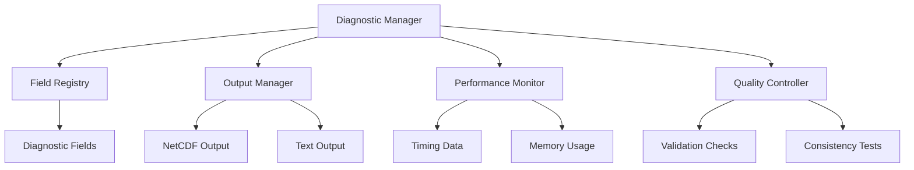

# Diagnostic System Guide

The CATChem diagnostic system provides comprehensive monitoring, analysis, and output capabilities for atmospheric chemistry simulations. This guide covers the diagnostic framework, configuration options, and usage patterns.

## Overview

The diagnostic system enables:

- **Real-time Monitoring**: Live tracking of model state and performance
- **Flexible Output**: Configurable diagnostic fields and frequencies
- **Performance Analysis**: Timing, memory usage, and computational metrics
- **Quality Assurance**: Automated validation and consistency checks
- **Scientific Analysis**: Process-specific diagnostics and budget terms

## Architecture

### Core Components



### Diagnostic Interface

```fortran
module DiagnosticManager_Mod
  use StateManager_Mod, only: StateManagerType
  use DiagnosticInterface_Mod
  use Error_Mod

  implicit none

  type :: DiagnosticManagerType
    type(DiagnosticRegistryType) :: registry
    type(ErrorManagerType), pointer :: error_manager
    logical :: is_initialized = .false.
  contains
    procedure :: init => diagnostic_manager_init
    procedure :: register_process_diagnostics => dm_register_process_diagnostics
    procedure :: collect_all_diagnostics => dm_collect_all_diagnostics
    procedure :: write_output => dm_write_output
    procedure :: finalize => diagnostic_manager_finalize
  end type DiagnosticManagerType

  type :: DiagnosticRegistryType
    type(DiagnosticFieldType), allocatable :: fields(:)
    integer :: num_fields = 0
  contains
    procedure :: register_field => dr_register_field
    procedure :: get_field => dr_get_field
    procedure :: update_field => dr_update_field
  end type DiagnosticRegistryType
```

## Field Registration

### Basic Field Registration

```fortran
! Register a diagnostic field
call diagnostics%register_field(                           &
  name = "ozone_concentration",                            &
  units = "kg/kg",                                         &
  long_name = "Ozone mass mixing ratio",                  &
  dimensions = ["longitude", "latitude", "level", "time"], &
  data_type = "real",                                      &
  rc = rc)
```

### Advanced Field Properties

```fortran
type :: DiagnosticField_t
  character(len=:), allocatable :: name
  character(len=:), allocatable :: units
  character(len=:), allocatable :: long_name
  character(len=:), allocatable :: standard_name
  character(len=:), allocatable :: dimensions(:)
  character(len=:), allocatable :: data_type
  real(r8) :: fill_value = -999.0_r8
  real(r8) :: valid_min = -huge(1.0_r8)
  real(r8) :: valid_max = huge(1.0_r8)
  logical :: time_varying = .true.
  character(len=:), allocatable :: output_frequency
  character(len=:), allocatable :: reduction_method
end type DiagnosticField_t
```

### Field Categories

```yaml
field_categories:
  state_variables:
    - "species_concentrations"
    - "temperature"
    - "pressure"
    - "humidity"

  process_rates:
    - "chemical_production_rates"
    - "chemical_loss_rates"
    - "emission_rates"
    - "deposition_rates"

  budget_terms:
    - "advection_tendency"
    - "diffusion_tendency"
    - "chemistry_tendency"
    - "total_tendency"

  performance_metrics:
    - "process_timing"
    - "memory_usage"
    - "solver_statistics"
```

## Configuration

### Basic Diagnostic Configuration

```yaml
diagnostics:
  output_frequency: "hourly"
  output_format: "netcdf"
  output_directory: "./output"
  file_prefix: "catchem_diag"

  # Global field settings
  compression: true
  compression_level: 4
  chunking: true
  chunk_sizes: [64, 64, 1, 1]  # lon, lat, lev, time

  # Output precision
  default_precision: "single"
  high_precision_fields: ["pressure", "temperature"]
```

### Field-Specific Configuration

```yaml
diagnostic_fields:
  ozone_concentration:
    name: "O3"
    output_frequency: "hourly"
    units: "ppbv"
    conversion_factor: 1.0e9
    vertical_coordinate: "pressure"

  nox_emissions:
    name: "EMIS_NOx"
    output_frequency: "daily"
    reduction_method: "sum"
    units: "kg/m2/day"

  chemical_budgets:
    name: "CHEM_BUDGET"
    output_frequency: "monthly"
    reduction_method: "mean"
    include_terms: ["production", "loss", "net"]
```

### Advanced Output Options

```yaml
output_options:
  # Multiple output streams
  streams:
    - name: "hourly_fields"
      frequency: "hourly"
      fields: ["O3", "NO2", "PM25"]
      format: "netcdf"

    - name: "daily_budgets"
      frequency: "daily"
      fields: ["*_BUDGET", "*_EMIS", "*_DEPO"]
      format: "netcdf"
      reduction: "sum"

    - name: "performance_log"
      frequency: "every_timestep"
      fields: ["timing", "memory"]
      format: "text"

  # Spatial and temporal subsetting
  subsetting:
    spatial:
      regions:
        - name: "north_america"
          bounds: [-180, -50, 10, 80]
        - name: "europe"
          bounds: [-20, 35, 40, 70]

    temporal:
      start_date: "2023-01-01"
      end_date: "2023-12-31"
      frequency: "monthly"
```

## Data Update and Collection

### Real-time Updates

```fortran
! Update a diagnostic field
call diagnostics%update_field("ozone_concentration", o3_data, rc)

! Accumulate over time
call diagnostics%accumulate_field("emission_flux", emission_rate * dt, rc)

! Set instantaneous values
call diagnostics%set_field("temperature", temperature_data, rc)
```

### Batch Updates

```fortran
! Update multiple fields at once
type(FieldUpdate_t) :: updates(3)

updates(1) = FieldUpdate_t("O3", o3_data)
updates(2) = FieldUpdate_t("NO2", no2_data)
updates(3) = FieldUpdate_t("PM25", pm25_data)

call diagnostics%update_fields(updates, rc)
```

### Conditional Updates

```fortran
! Update only if conditions are met
if (model_hour == 0) then
  call diagnostics%update_field("daily_max_o3", daily_max_values, rc)
end if

! Update with metadata
call diagnostics%update_field("temperature", temp_data, &
                              metadata=FieldMetadata_t(timestamp=current_time), &
                              rc=rc)
```

## Output Management

### NetCDF Output

```fortran
module OutputManager_Mod
  use netcdf
  use DiagnosticInterface_Mod

  type :: NetCDFOutput_t
    integer :: ncid
    character(len=:), allocatable :: filename
    type(FieldDictionary_t) :: variable_ids
  contains
    procedure :: create_file => ncdf_create_file
    procedure :: write_fields => ncdf_write_fields
    procedure :: close_file => ncdf_close_file
  end type NetCDFOutput_t
```

### Output Scheduling

```fortran
type :: OutputScheduler_t
  type(OutputTrigger_t), allocatable :: triggers(:)
  integer :: current_timestep
  real(r8) :: current_time
contains
  procedure :: check_output_needed
  procedure :: execute_output
end type OutputScheduler_t

! Example output trigger
type :: OutputTrigger_t
  character(len=:), allocatable :: frequency  ! "hourly", "daily", etc.
  integer :: interval                          ! Timestep interval
  character(len=:), allocatable :: fields(:)  ! Fields to output
  character(len=:), allocatable :: filename   ! Output filename
end type OutputTrigger_t
```

### File Management

```yaml
file_management:
  naming_convention: "${prefix}_${frequency}_${date}.nc"
  directory_structure: "${year}/${month}"
  file_splitting:
    method: "time"
    split_frequency: "monthly"
    max_file_size: "2GB"

  compression:
    algorithm: "zstd"
    level: 4
    shuffle: true

  metadata:
    include_provenance: true
    include_configuration: true
    cf_conventions: "1.8"
```

## Performance Monitoring

### Timing Diagnostics

```fortran
module PerformanceMonitor_Mod

  type :: TimingData_t
    character(len=:), allocatable :: process_name
    real(r8) :: start_time
    real(r8) :: end_time
    real(r8) :: elapsed_time
    integer :: call_count
  end type TimingData_t

  type :: PerformanceMonitor_t
    type(TimingData_t), allocatable :: timing_data(:)
    integer :: num_timers
  contains
    procedure :: start_timer
    procedure :: stop_timer
    procedure :: get_timing_summary
  end type PerformanceMonitor_t
```

### Memory Monitoring

```fortran
! Memory usage tracking
type :: MemoryMonitor_t
  integer(int64) :: peak_memory_usage
  integer(int64) :: current_memory_usage
  type(MemorySnapshot_t), allocatable :: snapshots(:)
contains
  procedure :: take_snapshot
  procedure :: get_memory_report
end type MemoryMonitor_t

! Usage example
call performance%start_timer("chemistry_solver", rc)
! ... chemistry calculations ...
call performance%stop_timer("chemistry_solver", rc)
```

### Performance Reporting

```yaml
performance_reporting:
  timing_summary:
    frequency: "end_of_run"
    include_statistics: true
    sort_by: "total_time"

  memory_report:
    frequency: "hourly"
    track_allocations: true
    include_stack_trace: false

  solver_statistics:
    frequency: "daily"
    include_convergence: true
    include_error_norms: true
```

## Quality Assurance

### Validation Checks

```fortran
module QualityController_Mod

  type :: ValidationCheck_t
    character(len=:), allocatable :: name
    character(len=:), allocatable :: field_name
    real(r8) :: min_valid_value
    real(r8) :: max_valid_value
    logical :: check_for_nan
    logical :: check_for_inf
  end type ValidationCheck_t

  type :: QualityController_t
    type(ValidationCheck_t), allocatable :: checks(:)
  contains
    procedure :: add_check
    procedure :: validate_field
    procedure :: generate_report
  end type QualityController_t
```

### Mass Conservation Checks

```fortran
! Mass conservation validation
subroutine check_mass_conservation(this, species_name, initial_mass, &
                                  final_mass, tolerance, rc)
  class(QualityController_t), intent(in) :: this
  character(len=*), intent(in) :: species_name
  real(r8), intent(in) :: initial_mass, final_mass, tolerance
  type(ErrorCode_t), intent(out) :: rc

  real(r8) :: relative_error

  relative_error = abs(final_mass - initial_mass) / initial_mass

  if (relative_error > tolerance) then
    call rc%set_warning("Mass conservation violation for " // species_name)
  else
    call rc%set_success()
  end if
end subroutine check_mass_conservation
```

### Automated Quality Control

```yaml
quality_control:
  mass_conservation:
    enabled: true
    tolerance: 1.0e-10
    check_frequency: "every_timestep"
    species: ["O3", "CO", "NOx"]

  physical_realism:
    enabled: true
    checks:
      - name: "positive_concentrations"
        fields: ["O3", "NO", "NO2"]
        min_value: 0.0

      - name: "temperature_range"
        fields: ["temperature"]
        min_value: 180.0
        max_value: 350.0

  statistical_checks:
    enabled: true
    frequency: "daily"
    checks:
      - name: "outlier_detection"
        method: "zscore"
        threshold: 3.0

      - name: "trend_analysis"
        window_size: 24  # hours
        max_trend: 0.1   # relative change
```

## Scientific Diagnostics

### Process-Specific Diagnostics

```yaml
process_diagnostics:
  chemistry:
    - "ozone_production_rate"
    - "ozone_loss_rate"
    - "nox_conversion_rate"
    - "radical_budget"

  transport:
    - "advection_tendency"
    - "diffusion_tendency"
    - "settling_velocity"

  emissions:
    - "emission_flux_by_source"
    - "temporal_emission_profile"
    - "spatial_emission_distribution"

  deposition:
    - "dry_deposition_velocity"
    - "wet_scavenging_coefficient"
    - "deposition_flux_by_landuse"
```

### Budget Analysis

```fortran
! Chemical budget calculation
type :: ChemicalBudget_t
  real(r8) :: production_rate
  real(r8) :: loss_rate
  real(r8) :: net_rate
  real(r8) :: transport_tendency
  real(r8) :: emission_rate
  real(r8) :: deposition_rate
end type ChemicalBudget_t

subroutine calculate_budget(species_name, budget, diagnostics, rc)
  character(len=*), intent(in) :: species_name
  type(ChemicalBudget_t), intent(out) :: budget
  type(DiagnosticInterface_t), intent(inout) :: diagnostics
  type(ErrorCode_t), intent(out) :: rc

  ! Calculate individual budget terms
  call diagnostics%get_field(species_name // "_production", &
                            budget%production_rate, rc)
  call diagnostics%get_field(species_name // "_loss", &
                            budget%loss_rate, rc)

  ! Calculate net rate
  budget%net_rate = budget%production_rate - budget%loss_rate

  ! Store budget diagnostics
  call diagnostics%update_field(species_name // "_net_rate", &
                               budget%net_rate, rc)
end subroutine calculate_budget
```

## Visualization and Analysis

### Real-time Visualization

```yaml
visualization:
  real_time_plots:
    enabled: true
    update_frequency: "hourly"
    plots:
      - type: "timeseries"
        variables: ["O3", "NO2", "PM25"]
        locations: ["urban", "rural", "background"]

      - type: "spatial_map"
        variable: "O3"
        level: "surface"

      - type: "vertical_profile"
        variable: "temperature"
        location: [40.0, -75.0]

  output_formats: ["png", "svg", "interactive_html"]
```

### Post-processing Integration

```python
# Example Python integration
import catchem_diagnostics as cd

# Load diagnostic data
diag_data = cd.load_diagnostics("catchem_output.nc")

# Create analysis
analysis = cd.DiagnosticAnalysis(diag_data)

# Generate standard plots
analysis.plot_timeseries("O3", save_as="o3_timeseries.png")
analysis.plot_budget("NOx", save_as="nox_budget.png")

# Custom analysis
correlation = analysis.correlate("O3", "temperature")
print(f"O3-Temperature correlation: {correlation}")
```

## Troubleshooting

### Common Issues

1. **Large output files**:
   ```yaml
   # Reduce output frequency or fields
   output_frequency: "daily"  # instead of "hourly"
   compression: true
   compression_level: 6
   ```

2. **Missing diagnostic fields**:
   ```fortran
   ! Check field registration
   if (.not. diagnostics%is_field_registered("field_name")) then
     call diagnostics%register_field("field_name", "units", "description", rc)
   end if
   ```

3. **Performance issues**:
   ```yaml
   # Optimize diagnostic frequency
   performance_monitoring:
     frequency: "end_of_run"  # instead of "every_timestep"
   ```

### Diagnostic Tools

```bash
# Validate diagnostic output
catchem_validate_diagnostics --input output.nc --config diag_config.yml

# Analyze performance data
catchem_performance_analysis --timing timing.log --memory memory.log

# Generate diagnostic summary
catchem_diagnostic_summary --input output.nc --output summary.html
```

## Related Documentation

- [Configuration Management](configuration-management.md)
- [Performance Guide](performance.md)
- [Process Infrastructure](process-infrastructure.md)
- [Output File Format](../user-guide/output-files.md)

---

*The diagnostic system provides comprehensive monitoring and analysis capabilities. For specific diagnostic configurations and troubleshooting, consult the user and developer guides.*
