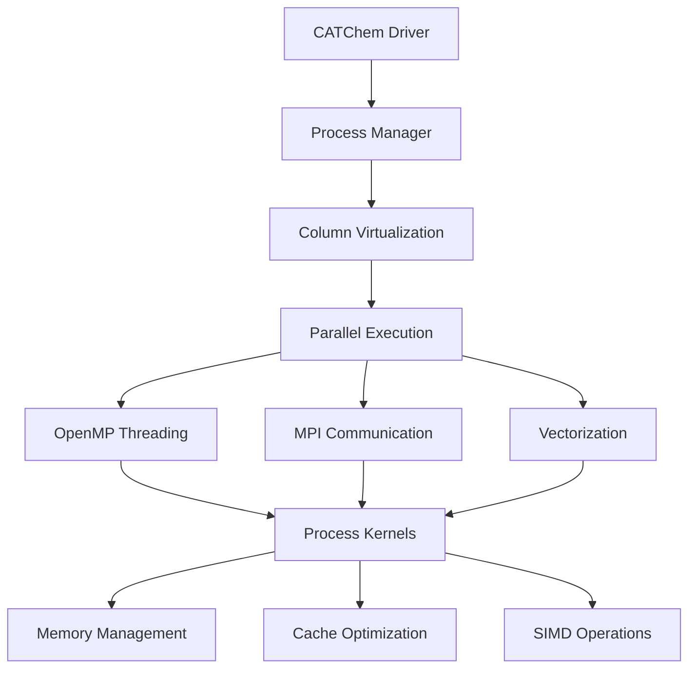

# Performance Guide

This comprehensive guide covers performance optimization strategies, benchmarking, and best practices for achieving optimal computational efficiency with CATChem.

## Overview

CATChem performance optimization encompasses:

- **Computational Efficiency**: Algorithm optimization and numerical methods
- **Memory Management**: Efficient memory usage and data layout
- **Parallel Scalability**: MPI, OpenMP, and hybrid parallelization
- **I/O Optimization**: High-performance file operations and data formats
- **System Integration**: Hardware-specific optimizations and tuning

## Performance Architecture

### Computational Framework



### Performance Monitoring

```fortran
module PerformanceManager_Mod
  use precision_mod
  use timing_mod

  type :: PerformanceManager_t
    type(TimingCollector_t) :: timing
    type(MemoryProfiler_t) :: memory
    type(CacheProfiler_t) :: cache
    type(ScalingAnalyzer_t) :: scaling
  contains
    procedure :: initialize => pm_initialize
    procedure :: start_profiling => pm_start_profiling
    procedure :: stop_profiling => pm_stop_profiling
    procedure :: generate_report => pm_generate_report
  end type PerformanceManager_t
```

## Column Virtualization Performance

### Optimization Principles

Column virtualization enables:

1. **Memory Locality**: Optimal cache usage with 1D data access
2. **Vectorization**: SIMD operations on column data
3. **Load Balancing**: Dynamic work distribution
4. **Scalability**: Efficient parallel processing

### Implementation

```fortran
! Optimized column processing loop
subroutine process_columns_optimized(num_columns, column_data, &
                                    process_kernel, rc)
  integer, intent(in) :: num_columns
  type(ColumnData_t), intent(inout) :: column_data(:)
  procedure(process_kernel_interface) :: process_kernel
  type(ErrorCode_t), intent(out) :: rc

  integer :: i, chunk_size, num_threads
  integer :: thread_id, start_idx, end_idx

  ! Determine optimal chunk size
  num_threads = omp_get_max_threads()
  chunk_size = max(1, num_columns / (num_threads * 4))

  !$OMP PARALLEL DO SCHEDULE(DYNAMIC, chunk_size) &
  !$OMP PRIVATE(i, thread_id, start_idx, end_idx)
  do i = 1, num_columns
    thread_id = omp_get_thread_num()

    ! Process column with optimized kernel
    call process_kernel(column_data(i), thread_id, rc)

    if (rc%is_error()) then
      !$OMP CRITICAL
      call handle_processing_error(i, rc)
      !$OMP END CRITICAL
    end if
  end do
  !$OMP END PARALLEL DO
end subroutine process_columns_optimized
```

### Memory Layout Optimization

```fortran
! Optimized column data structure
type :: OptimizedColumnData_t
  ! Structure of Arrays (SoA) for better vectorization
  real(r8), allocatable :: species_concentrations(:,:)  ! (species, levels)
  real(r8), allocatable :: temperature(:)               ! (levels)
  real(r8), allocatable :: pressure(:)                  ! (levels)
  real(r8), allocatable :: reaction_rates(:,:)          ! (reactions, levels)

  ! Cache-aligned allocation
  integer, parameter :: CACHE_LINE_SIZE = 64
  integer, parameter :: ALIGNMENT = CACHE_LINE_SIZE / 8  ! 8 bytes per real(r8)
contains
  procedure :: allocate_aligned => ocd_allocate_aligned
  procedure :: deallocate => ocd_deallocate
end type OptimizedColumnData_t
```

## Parallel Performance

### MPI Parallelization

#### Domain Decomposition

```fortran
module DomainDecomposition_Mod

  type :: DomainDecomposition_t
    integer :: num_procs
    integer :: my_rank
    integer :: dims(2)              ! 2D processor grid
    integer :: coords(2)            ! My coordinates in grid
    integer :: neighbors(4)         ! North, South, East, West

    ! Local domain bounds
    integer :: local_i_start, local_i_end
    integer :: local_j_start, local_j_end
    integer :: local_num_columns
  contains
    procedure :: initialize => dd_initialize
    procedure :: exchange_halo => dd_exchange_halo
    procedure :: gather_results => dd_gather_results
  end type DomainDecomposition_t
```

#### Communication Optimization

```fortran
! Optimized halo exchange
subroutine dd_exchange_halo(this, field_data, rc)
  class(DomainDecomposition_t), intent(in) :: this
  real(r8), intent(inout) :: field_data(:,:,:)  ! (i, j, species)
  type(ErrorCode_t), intent(out) :: rc

  integer :: req(4), status(MPI_STATUS_SIZE, 4)
  integer :: tag_base = 1000

  ! Non-blocking communication for all neighbors
  ! Send to North, receive from South
  call MPI_Isend(field_data(:, this%local_j_end, :), &
                 size(field_data, 1) * size(field_data, 3), &
                 MPI_DOUBLE_PRECISION, this%neighbors(1), &
                 tag_base + 1, MPI_COMM_WORLD, req(1), ierr)

  call MPI_Irecv(field_data(:, this%local_j_start-1, :), &
                 size(field_data, 1) * size(field_data, 3), &
                 MPI_DOUBLE_PRECISION, this%neighbors(2), &
                 tag_base + 1, MPI_COMM_WORLD, req(2), ierr)

  ! Similar for East-West exchange...

  ! Wait for all communications to complete
  call MPI_Waitall(4, req, status, ierr)
end subroutine dd_exchange_halo
```

### OpenMP Optimization

#### Thread-Safe Processing

```fortran
! Thread-safe process implementation
subroutine chemistry_process_threaded(this, column_data, time_step, rc)
  class(ChemistryProcess_t), intent(in) :: this
  type(ColumnData_t), intent(inout) :: column_data
  real(r8), intent(in) :: time_step
  type(ErrorCode_t), intent(out) :: rc

  integer :: thread_id, num_levels, level
  real(r8), allocatable :: local_workspace(:,:)

  thread_id = omp_get_thread_num()
  num_levels = size(column_data%temperature)

  ! Thread-local workspace
  allocate(local_workspace(this%num_species, num_levels))

  ! Process levels with optimal vectorization
  !$OMP SIMD PRIVATE(level)
  do level = 1, num_levels
    call solve_chemistry_level(column_data, level, time_step, &
                               local_workspace(:, level), rc)
  end do
  !$OMP END SIMD

  ! Update results
  column_data%species_concentrations = local_workspace

  deallocate(local_workspace)
end subroutine chemistry_process_threaded
```

#### NUMA Optimization

```fortran
! NUMA-aware memory allocation
module NUMAOptimization_Mod

  type :: NUMAManager_t
    integer :: num_numa_nodes
    integer :: threads_per_node
    integer, allocatable :: thread_to_node(:)
  contains
    procedure :: initialize_numa => nm_initialize_numa
    procedure :: allocate_numa_aware => nm_allocate_numa_aware
    procedure :: bind_thread_to_node => nm_bind_thread_to_node
  end type NUMAManager_t

  ! NUMA-aware allocation
  subroutine nm_allocate_numa_aware(this, size_per_thread, data_arrays, rc)
    class(NUMAManager_t), intent(in) :: this
    integer, intent(in) :: size_per_thread
    real(r8), allocatable, intent(out) :: data_arrays(:,:)
    type(ErrorCode_t), intent(out) :: rc

    integer :: thread_id, numa_node

    !$OMP PARALLEL PRIVATE(thread_id, numa_node)
    thread_id = omp_get_thread_num()
    numa_node = this%thread_to_node(thread_id)

    ! Allocate on local NUMA node
    call allocate_on_numa_node(data_arrays(:, thread_id), &
                               size_per_thread, numa_node, rc)
    !$OMP END PARALLEL
  end subroutine nm_allocate_numa_aware
```

## Memory Performance

### Memory Layout Optimization

```fortran
! Cache-friendly data structures
type :: CacheOptimizedState_t
  ! Hot data (frequently accessed)
  real(r8), allocatable :: concentrations(:,:,:)  ! (species, levels, columns)
  real(r8), allocatable :: temperature(:,:)       ! (levels, columns)
  real(r8), allocatable :: pressure(:,:)          ! (levels, columns)

  ! Cold data (infrequently accessed)
  real(r8), allocatable :: diagnostic_fields(:,:,:)

  ! Metadata
  integer :: num_species, num_levels, num_columns
  integer :: cache_line_padding(8)  ! Prevent false sharing
```

### Memory Pool Management

```fortran
module MemoryPool_Mod

  type :: MemoryPool_t
    real(r8), allocatable :: pool(:)
    integer, allocatable :: free_blocks(:)
    integer :: pool_size
    integer :: block_size
    integer :: num_free_blocks
  contains
    procedure :: initialize => mp_initialize
    procedure :: allocate_block => mp_allocate_block
    procedure :: deallocate_block => mp_deallocate_block
    procedure :: get_statistics => mp_get_statistics
  end type MemoryPool_t

  ! High-performance memory allocation
  function mp_allocate_block(this, size_needed) result(block_ptr)
    class(MemoryPool_t), intent(inout) :: this
    integer, intent(in) :: size_needed
    real(r8), pointer :: block_ptr(:)

    integer :: block_index

    if (this%num_free_blocks > 0) then
      block_index = this%free_blocks(this%num_free_blocks)
      this%num_free_blocks = this%num_free_blocks - 1

      block_ptr => this%pool(block_index:block_index+size_needed-1)
    else
      ! Pool exhausted - expand or fall back to system allocation
      call expand_memory_pool(this)
      block_ptr => mp_allocate_block(this, size_needed)
    end if
  end function mp_allocate_block
```

## I/O Performance

### Parallel NetCDF Optimization

```fortran
module ParallelIO_Mod
  use mpi
  use netcdf
  use netcdf_parallel

  type :: ParallelIOManager_t
    integer :: ncid
    integer :: comm
    integer :: info
    logical :: collective_mode = .true.
  contains
    procedure :: open_parallel_file => pio_open_parallel_file
    procedure :: write_parallel_data => pio_write_parallel_data
    procedure :: optimize_chunking => pio_optimize_chunking
  end type ParallelIOManager_t

  ! Optimized parallel write
  subroutine pio_write_parallel_data(this, var_name, local_data, &
                                     global_dims, local_start, rc)
    class(ParallelIOManager_t), intent(in) :: this
    character(len=*), intent(in) :: var_name
    real(r8), intent(in) :: local_data(:,:,:)
    integer, intent(in) :: global_dims(:)
    integer, intent(in) :: local_start(:)
    type(ErrorCode_t), intent(out) :: rc

    integer :: varid, ndims
    integer, allocatable :: start(:), count(:)

    ! Set up parallel access
    call nf90_inq_varid(this%ncid, var_name, varid)
    call nf90_var_par_access(this%ncid, varid, NF90_COLLECTIVE)

    ! Define local data slice
    ndims = size(global_dims)
    allocate(start(ndims), count(ndims))

    start = local_start
    count = shape(local_data)

    ! Perform collective write
    call nf90_put_var(this%ncid, varid, local_data, start, count)
  end subroutine pio_write_parallel_data
```

### I/O Buffering Strategy

```fortran
! Asynchronous I/O buffering
type :: AsyncIOBuffer_t
  real(r8), allocatable :: write_buffer(:,:,:)
  real(r8), allocatable :: compute_buffer(:,:,:)
  logical :: write_in_progress = .false.
  integer :: buffer_size
  integer :: current_timestep
contains
  procedure :: swap_buffers => aio_swap_buffers
  procedure :: async_write => aio_async_write
  procedure :: wait_for_write => aio_wait_for_write
end type AsyncIOBuffer_t

! Double buffering for overlap of computation and I/O
subroutine aio_swap_buffers(this)
  class(AsyncIOBuffer_t), intent(inout) :: this
  real(r8), allocatable :: temp_buffer(:,:,:)

  ! Wait for previous write to complete
  call this%wait_for_write()

  ! Swap buffers
  call move_alloc(this%write_buffer, temp_buffer)
  call move_alloc(this%compute_buffer, this%write_buffer)
  call move_alloc(temp_buffer, this%compute_buffer)
end subroutine aio_swap_buffers
```

## Compiler Optimizations

### Fortran Optimization Flags

```makefile
# Intel Fortran Compiler
FFLAGS_INTEL = -O3 -xHost -ipo -no-prec-div -fp-model fast=2
FFLAGS_INTEL += -qopenmp -parallel -par-threshold0
FFLAGS_INTEL += -vec-report=2 -qopt-report=5

# GNU Fortran Compiler
FFLAGS_GNU = -O3 -march=native -mtune=native -funroll-loops
FFLAGS_GNU += -ffast-math -ftree-vectorize -fopenmp
FFLAGS_GNU += -flto -fwhole-program

# NVIDIA HPC Compiler
FFLAGS_NVHPC = -O3 -fast -Mipa=fast,inline
FFLAGS_NVHPC += -mp=multicore -Mvect=simd
FFLAGS_NVHPC += -Minfo=accel,inline,intensity,loop,lre,mp,par,vect
```

### Profile-Guided Optimization

```bash
# Step 1: Compile with profiling instrumentation
make FFLAGS="-O2 -prof-gen"

# Step 2: Run representative workload
./catchem_driver --config training_case.yaml

# Step 3: Recompile with profile data
make clean
make FFLAGS="-O3 -prof-use"
```

## Performance Benchmarking

### Benchmark Suite

```fortran
program catchem_benchmark
  use PerformanceManager_Mod
  use BenchmarkSuite_Mod

  type(PerformanceManager_t) :: perf_manager
  type(BenchmarkSuite_t) :: benchmark

  ! Initialize benchmarking
  call perf_manager%initialize()
  call benchmark%initialize()

  ! Run standard benchmarks
  call benchmark%run_scalability_test(perf_manager)
  call benchmark%run_memory_bandwidth_test(perf_manager)
  call benchmark%run_chemistry_kernel_test(perf_manager)
  call benchmark%run_io_throughput_test(perf_manager)

  ! Generate performance report
  call perf_manager%generate_report("benchmark_results.json")
end program catchem_benchmark
```

### Scalability Analysis

```fortran
! Scaling efficiency calculation
type :: ScalingResults_t
  integer, allocatable :: num_processes(:)
  real(r8), allocatable :: execution_times(:)
  real(r8), allocatable :: parallel_efficiency(:)
  real(r8), allocatable :: strong_scaling_efficiency(:)
  real(r8), allocatable :: weak_scaling_efficiency(:)
end type ScalingResults_t

subroutine calculate_scaling_efficiency(results)
  type(ScalingResults_t), intent(inout) :: results

  real(r8) :: serial_time, ideal_time
  integer :: i

  serial_time = results%execution_times(1)

  do i = 1, size(results%num_processes)
    ideal_time = serial_time / results%num_processes(i)
    results%parallel_efficiency(i) = ideal_time / results%execution_times(i)
    results%strong_scaling_efficiency(i) = results%parallel_efficiency(i) * 100.0
  end do
end subroutine calculate_scaling_efficiency
```

## Performance Tuning Guidelines

### System-Specific Optimization

#### Intel Xeon Systems

```bash
# Intel-specific optimizations
export KMP_AFFINITY=granularity=fine,compact,1,0
export KMP_BLOCKTIME=1
export OMP_NUM_THREADS=28  # Physical cores
export I_MPI_PIN_DOMAIN=omp
export I_MPI_FABRICS=shm:ofi
```

#### AMD EPYC Systems

```bash
# AMD-specific optimizations
export OMP_PROC_BIND=close
export OMP_PLACES=cores
export GOMP_CPU_AFFINITY="0-63"
export UCX_NET_DEVICES=mlx5_0:1
```

#### GPU Acceleration

```fortran
! OpenACC directives for GPU acceleration
subroutine chemistry_solver_gpu(concentrations, reaction_rates, &
                               time_step, num_species, num_levels)
  real(r8), intent(inout) :: concentrations(:,:)
  real(r8), intent(in) :: reaction_rates(:,:)
  real(r8), intent(in) :: time_step
  integer, intent(in) :: num_species, num_levels

  integer :: level, species

  !$acc parallel loop collapse(2) &
  !$acc private(level, species) &
  !$acc present(concentrations, reaction_rates)
  do level = 1, num_levels
    do species = 1, num_species
      concentrations(species, level) = concentrations(species, level) + &
        reaction_rates(species, level) * time_step
    end do
  end do
  !$acc end parallel loop
end subroutine chemistry_solver_gpu
```

### Performance Configuration

```yaml
performance:
  threading:
    openmp_threads: 28
    thread_affinity: "compact"
    nested_parallelism: false

  memory:
    large_pages: true
    numa_policy: "local"
    memory_pool_size: "2GB"

  mpi:
    process_binding: true
    communication_protocol: "ofi"
    collective_algorithms: "optimized"

  io:
    parallel_netcdf: true
    chunking_strategy: "optimized"
    compression_level: 1
    async_io: true

  compiler:
    optimization_level: "aggressive"
    vectorization: true
    loop_unrolling: true
    interprocedural_optimization: true
```

## Performance Monitoring

### Runtime Performance Tracking

```fortran
! Lightweight performance monitoring
type :: PerformanceCounter_t
  character(len=32) :: name
  real(r8) :: total_time = 0.0
  real(r8) :: min_time = huge(1.0_r8)
  real(r8) :: max_time = 0.0
  integer :: call_count = 0
  real(r8) :: start_time
contains
  procedure :: start => pc_start
  procedure :: stop => pc_stop
  procedure :: get_average => pc_get_average
end type PerformanceCounter_t

! Usage pattern
type(PerformanceCounter_t) :: chemistry_timer
call chemistry_timer%start()
! ... chemistry calculations ...
call chemistry_timer%stop()
```

### System Resource Monitoring

```bash
# Resource monitoring during execution
#!/bin/bash
# monitor_catchem.sh

PID=$1
INTERVAL=10
LOGFILE="performance.log"

echo "Timestamp,CPU_Usage,Memory_MB,IO_Read_MB,IO_Write_MB" > $LOGFILE

while kill -0 $PID 2>/dev/null; do
    TIMESTAMP=$(date '+%Y-%m-%d %H:%M:%S')
    CPU=$(ps -p $PID -o %cpu --no-headers)
    MEM=$(ps -p $PID -o rss --no-headers)
    IO_STATS=$(cat /proc/$PID/io 2>/dev/null)

    echo "$TIMESTAMP,$CPU,$MEM,$IO_READ,$IO_WRITE" >> $LOGFILE
    sleep $INTERVAL
done
```

## Troubleshooting Performance Issues

### Common Performance Problems

1. **Poor scalability**:
   ```bash
   # Check load balancing
   mpirun -np 4 catchem_driver --profile-load-balance
   ```

2. **Memory bottlenecks**:
   ```fortran
   ! Enable memory debugging
   use MemoryProfiler_Mod
   call memory_profiler%track_allocations(.true.)
   ```

3. **I/O limitations**:
   ```yaml
   # Optimize I/O configuration
   io:
     stripe_count: 8
     stripe_size: "1MB"
     collective_buffering: true
   ```

### Performance Analysis Tools

```bash
# Intel VTune Profiler
vtune -collect hotspots -- mpirun -np 16 catchem_driver

# ARM Forge (formerly Allinea)
map --profile mpirun -np 32 catchem_driver

# Scalasca
scalasca -analyze mpirun -np 64 catchem_driver

# PAPI hardware counters
export PAPI_EVENTS="PAPI_L3_TCM,PAPI_TOT_CYC,PAPI_TOT_INS"
```

## Related Documentation

- [Column Virtualization Guide](column-virtualization.md)
- [Build System](../developer-guide/build-system.md)
- [HPC Installation](../developer-guide/hpc-installation.md)
- [Configuration Guide](configuration-management.md)

---

*This performance guide provides comprehensive optimization strategies for achieving maximum computational efficiency with CATChem. For specific platform optimizations, consult your system administrator and the relevant compiler documentation.*
