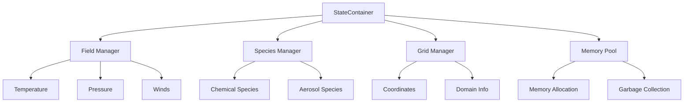

# StateContainer Guide

The StateContainer is CATChem's central data management system, providing unified access to all model state variables.

## Overview

The StateContainer manages:
- **Chemical Species**: Atmospheric constituent concentrations
- **Meteorological Fields**: Temperature, pressure, winds, etc.
- **Diagnostic Variables**: Process-specific diagnostic output
- **Grid Information**: Coordinate systems and domain decomposition
- **Memory Management**: Efficient allocation and cleanup

## Architecture



## Basic Usage

### Initialization

```fortran
use State_Mod
implicit none

type(StateContainerType) :: container
integer :: rc

! Initialize state container
call container%init(config_file="catchem.yml", rc=rc)
if (rc /= CC_SUCCESS) then
  call error_handler%log_error("Failed to initialize StateContainer", rc)
  stop
end if
```

### Field Access

```fortran
! Get field pointers (read-only)
real(fp), pointer :: temperature(:,:,:)
real(fp), pointer :: pressure(:,:,:)

call container%get_field("temperature", temperature, rc)
call container%get_field("pressure", pressure, rc)

! Get writable field access
real(fp), pointer :: ozone(:,:,:)
call container%get_field_writable("ozone", ozone, rc)

! Modify field data
ozone = ozone * 1.1_fp  ! 10% increase
```

### Species Management

```fortran
! Add new species
call container%add_species("dust1", "kg/kg", "Fine dust particles", rc)
call container%add_species("dust2", "kg/kg", "Coarse dust particles", rc)

! Get species data
real(fp), pointer :: dust1(:,:,:)
call container%get_species("dust1", dust1, rc)

! Set species data
real(fp) :: initial_concentration(nx, ny, nz)
initial_concentration = 1.0e-9_fp
call container%set_species("dust1", initial_concentration, rc)
```

## Advanced Features

### Field Creation and Management

```fortran
! Create custom diagnostic field
type(FieldMetadataType) :: metadata

metadata%name = "settling_velocity"
metadata%units = "m/s"
metadata%description = "Gravitational settling velocity"
metadata%dimensions = ["longitude", "latitude", "level"]

call container%create_field(metadata, rc)

! Set field data
real(fp) :: velocity_data(nx, ny, nz)
! ... compute velocity_data ...
call container%set_field("settling_velocity", velocity_data, rc)
```

### Memory Management

```fortran
! Check memory usage
real(fp) :: memory_mb
call container%get_memory_usage(memory_mb)
print *, "StateContainer using", memory_mb, "MB"

! Force garbage collection
call container%cleanup_unused_fields(rc)

! Set memory limits
call container%set_memory_limit(8000.0_fp, rc)  ! 8 GB limit
```

### Grid Information

```fortran
! Get grid dimensions
integer :: nx, ny, nz
call container%get_dimensions(nx, ny, nz, rc)

! Get coordinate information
real(fp), pointer :: longitude(:), latitude(:), levels(:)
call container%get_coordinates(longitude, latitude, levels, rc)

! Get grid spacing
real(fp) :: dx, dy
call container%get_grid_spacing(dx, dy, rc)
```

## Column Processing Integration

### Column Extraction

```fortran
use ColumnInterface_Mod

type(ColumnDataType) :: column_data
integer :: column_index

! Extract column data
column_index = compute_column_index(i, j)
call container%extract_column(column_index, column_data, rc)

! Process column data
call process_atmospheric_column(column_data, rc)

! Update container with modified column
call container%update_column(column_index, column_data, rc)
```

### Bulk Column Operations

```fortran
! Process all columns in parallel
!$OMP PARALLEL DO PRIVATE(column_data)
do column_index = 1, container%get_num_columns()
  call container%extract_column(column_index, column_data, rc)
  call atmospheric_process(column_data, rc)
  call container%update_column(column_index, column_data, rc)
end do
!$OMP END PARALLEL DO
```

## Field Types and Metadata

### Standard Field Types

| Field Type | Description | Typical Units |
|------------|-------------|---------------|
| `meteorological` | Temperature, pressure, winds | K, Pa, m/s |
| `chemical_species` | Atmospheric constituents | kg/kg, molecules/cm³ |
| `diagnostic` | Process-specific outputs | Various |
| `coordinate` | Spatial coordinates | degrees, meters |

### Field Metadata

```fortran
type :: FieldMetadataType
  character(len=:), allocatable :: name
  character(len=:), allocatable :: units
  character(len=:), allocatable :: description
  character(len=:), allocatable :: standard_name
  character(len=:), allocatable :: dimensions(:)
  real(fp) :: missing_value
  real(fp) :: valid_min, valid_max
  logical :: time_varying
end type
```

## Data Validation

### Automatic Validation

```fortran
! Enable field validation
call container%enable_validation(.true.)

! Set validation criteria
call container%set_valid_range("temperature", 150.0_fp, 350.0_fp, rc)
call container%set_valid_range("pressure", 100.0_fp, 110000.0_fp, rc)

! Validation happens automatically on field updates
call container%set_field("temperature", temp_data, rc)
! Will fail if temp_data contains values outside valid range
```

### Custom Validation

```fortran
! Define custom validation function
interface
  function validate_ozone(field_data) result(is_valid)
    real(fp), intent(in) :: field_data(:,:,:)
    logical :: is_valid
  end function
end interface

! Register validator
call container%register_validator("ozone", validate_ozone, rc)
```

## Performance Optimization

### Memory Pool Configuration

```fortran
! Configure memory pools for different field types
call container%configure_memory_pool("meteorological", &
                                      initial_size=100, &
                                      growth_factor=1.5_fp, rc=rc)

call container%configure_memory_pool("chemical_species", &
                                      initial_size=200, &
                                      growth_factor=2.0_fp, rc=rc)
```

### Lazy Loading

```fortran
! Enable lazy loading for large fields
call container%enable_lazy_loading("large_diagnostic_field", .true., rc)

! Field data loaded only when accessed
real(fp), pointer :: large_field(:,:,:)
call container%get_field("large_diagnostic_field", large_field, rc)
! Data loaded here on first access
```

### Caching Strategy

```fortran
! Configure field caching
call container%set_cache_policy("frequently_used_field", "always_cache", rc)
call container%set_cache_policy("temporary_field", "no_cache", rc)
call container%set_cache_policy("diagnostic_field", "cache_on_demand", rc)
```

## Integration with Processes

### Process Registration

```fortran
! Register process with StateContainer
call container%register_process("settling", settling_process, rc)

! Process can now access container fields
call settling_process%run(container, rc)
```

### Field Dependencies

```fortran
! Declare field dependencies
call settling_process%declare_input_fields(["temperature", "pressure", "air_density"], rc)
call settling_process%declare_output_fields(["settling_velocity"], rc)

! StateContainer ensures required fields are available
call container%validate_process_dependencies("settling", rc)
```

## Debugging and Diagnostics

### Field Inspection

```fortran
! Get field statistics
type(FieldStatsType) :: stats
call container%get_field_stats("temperature", stats, rc)

print *, "Temperature statistics:"
print *, "  Min:", stats%min_value
print *, "  Max:", stats%max_value
print *, "  Mean:", stats%mean_value
print *, "  Std Dev:", stats%std_dev
```

### Memory Debugging

```fortran
! Enable memory debugging
call container%enable_memory_debugging(.true.)

! Get detailed memory report
call container%print_memory_report("memory_debug.txt", rc)
```

### Field History

```fortran
! Enable field history tracking
call container%enable_field_history("ozone", .true., rc)

! Get field modification history
type(FieldHistoryType) :: history
call container%get_field_history("ozone", history, rc)

! Print modification log
do i = 1, history%num_modifications
  print *, "Modified at:", history%timestamps(i)
  print *, "By process:", history%process_names(i)
end do
```

## Best Practices

### Efficient Field Access

```fortran
! Good: Get pointer once, use many times
real(fp), pointer :: temperature(:,:,:)
call container%get_field("temperature", temperature, rc)

do k = 1, nz
  do j = 1, ny
    do i = 1, nx
      ! Use temperature(i,j,k) directly
    end do
  end do
end do

! Avoid: Getting field pointer in loop
do k = 1, nz
  call container%get_field("temperature", temperature, rc)  ! Inefficient!
  ! ...
end do
```

### Memory Management

```fortran
! Clean up temporary fields
call container%remove_temporary_fields(rc)

! Use memory-efficient data types
call container%set_default_precision("single", rc)  ! For appropriate fields

! Monitor memory usage
if (container%get_memory_usage() > memory_limit) then
  call container%cleanup_unused_fields(rc)
end if
```

### Error Handling

```fortran
! Always check return codes
call container%get_field("ozone", ozone_ptr, rc)
if (rc /= CC_SUCCESS) then
  call error_handler%log_error("Failed to get ozone field", rc)
  ! Handle error appropriately
  return
end if

! Use safe field access
if (container%has_field("optional_field")) then
  call container%get_field("optional_field", field_ptr, rc)
end if
```

---

*The StateContainer is the heart of CATChem's data management system. Understanding its capabilities is essential for effective CATChem development and usage.*
