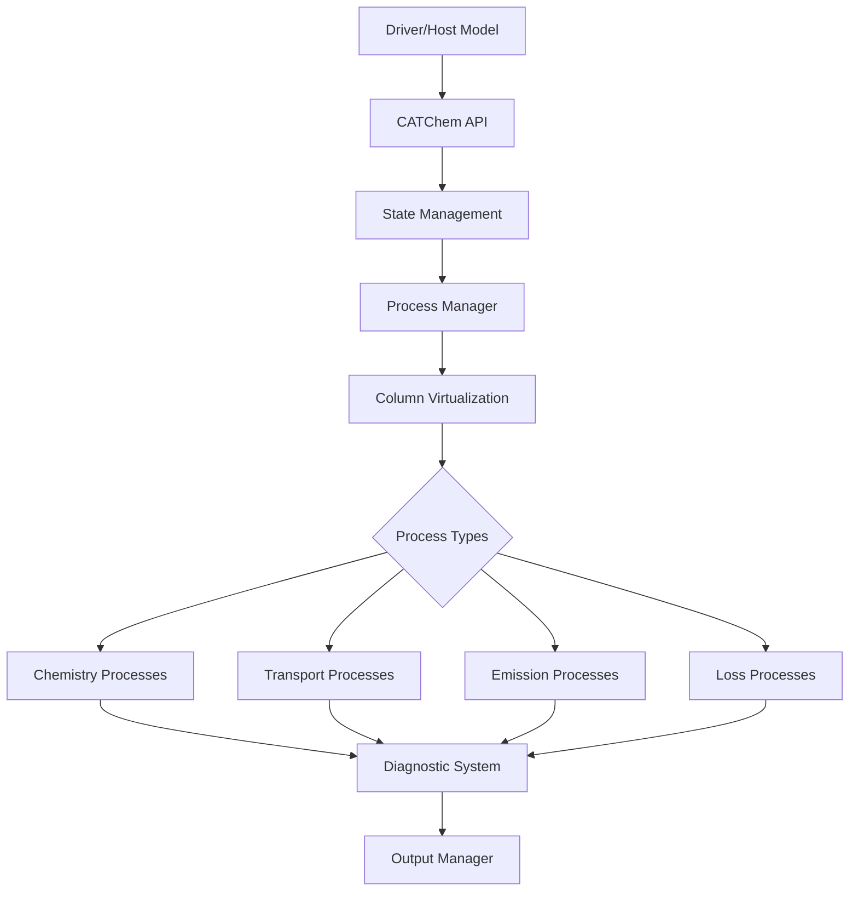

# CATChem Library and Modeling Component

CATChem (Configurable ATmospheric Chemistry) is a library and modeling component that includes all chemical and aerosol processes needed to perform atmospheric chemistry and composition simulations within a model through a flexible, easy to modify, and well-documented infrastructure. CATChem will include the following processes: chemical kinetics, aerosols, photolysis, wet deposition, dry deposition, connections to emissions, and connection to physics schemes. CATChem is integrated into NOAA’s Unified Forecasting System (https://ufscommunity.org/) to create UFS-Chem. UFS-Chem is a modern, high-performance atmospheric chemistry model designed for operational and research applications including weather, air quality, and smoke forecasting. Built with modern Fortran and designed for scalability, CATChem provides sophisticated atmospheric chemistry capabilities as an open-source community project.

## ✨ Key Features

<div class="grid cards" markdown>

- :material-rocket-launch: **High Performance**

  ---

  Optimized for modern HPC systems with column virtualization, efficient memory management, and scalable parallelization.

- :material-puzzle: **Modular Architecture**

  ---

  Process-based design with pluggable schemes, flexible configuration, and clean separation of concerns.

- :material-cog: **Operational Ready**

  ---

  Designed for 24/7 operational use with robust error handling, comprehensive diagnostics, and monitoring capabilities.

- :material-flask-empty-outline: **Comprehensive Chemistry**

  ---

  Full atmospheric chemistry including gas-phase, aerosol processes, emissions, deposition, and transport.

</div>

## 🚀 Quick Start

=== "Installation"

    ```bash
    # Clone the repository
    git clone https://github.com/UFS-Community/CATChem.git
    cd CATChem

    # Build with CMake
    mkdir build && cd build
    cmake ..
    make -j$(nproc)
    ```

=== "Testing"

    ```bash
    # Run a test case
    cd build
    ctest -R test_CATChemCore

    ```

=== "Integration"

    ```fortran
    ! Integrate with your model
    use CATChemAPI_Mod

    type(CATChemType) :: catchem

    call catchem%init(config_file, rc)
    call catchem%run(dt, met_fields, chem_fields, rc)
    call catchem%finalize(rc)
    ```

## 🧪 Available Processes

| Process Type | Description | Status |
|--------------|-------------|--------|
| <span class="process-badge process-badge--chemistry">Chemistry</span> | Gas-phase and aerosol chemistry | ✅ Production |
| <span class="process-badge process-badge--emission">Emissions</span> | Anthropogenic and biogenic emissions | ✅ Production |
| <span class="process-badge process-badge--transport">Settling</span> | Gravitational settling with slip correction | ✅ Production |
| <span class="process-badge process-badge--loss">Dry Deposition</span> | Surface deposition processes | ✅ Production |
| <span class="process-badge process-badge--loss">Wet Deposition</span> | Precipitation scavenging | 🚧 Development |
| <span class="process-badge process-badge--emission">Dust</span> | Mineral dust emission and transport | ✅ Production |
| <span class="process-badge process-badge--emission">Sea Salt</span> | Marine aerosol processes | ✅ Production |
| <span class="process-badge process-badge--transport">Plume Rise</span> | Wildfire and point source plume rise | ✅ Production |

## 🏗️ Architecture Overview



!!! note "Modern Design Principles"
    - **Separation of Concerns**: Clear boundaries between I/O, computation, and state management
    - **Column Virtualization**: Efficient 1D processing with automatic parallelization
    - **Process-Based Architecture**: Modular, testable, and maintainable components
    - **StateContainer Pattern**: Unified data management with automatic dependency tracking
    - **Comprehensive Diagnostics**: Built-in monitoring, profiling, and error reporting

## 🎯 Use Cases

### Operational Weather Prediction
- **NOAA UFS Integration**: Native support for FV3 and other UFS components
- **Real-time Processing**: Optimized for operational time constraints
- **Ensemble Forecasting**: Efficient multi-member ensemble capabilities

### Research Applications
- **Process Studies**: Individual process testing and validation
- **Sensitivity Analysis**: Parameter perturbation and uncertainty quantification
- **Model Development**: Framework for new process implementation

### Air Quality Forecasting
- **Multi-scale Modeling**: Global to urban scale applications
- **Chemical Data Assimilation**: Support for observation integration
- **Health Impact Assessment**: Human exposure and risk evaluation

## 📚 Documentation Structure

<div class="grid cards" markdown>

- [:material-rocket-launch-outline: **Quick Start**](old_guides/quick-start/index.md)

  ---

  Get up and running with CATChem in minutes

- [:material-book-open-variant: **User Guide**](user-guide/index.md)

  ---

  Comprehensive guide for model users

- [:material-code-braces: **Developer Guide**](developer-guide/index.md)

  ---

  Technical documentation for developers

- [:material-api: **API Reference**](api/index.md)

  ---

  Complete API documentation

- [:material-earth: **UFS-Chem**](ufschem/index.md)

  ---

  CATChem is incorporated into the UFS to create UFS-Chem or the Unified Forecast System with Chemistry

- [:material-handshake-outline: **Community Engagement**](community/index.md)

  ---

  Learn more how you can use, test, or develop CATChem and UFS-Chem!

</div>

## 🤝 Community & Support Quick Reference

- **GitHub Repository**: [UFS-Community/CATChem](https://github.com/UFS-Community/CATChem)
- **Documentation**: [https://catchem.readthedocs.io](https://catchem.readthedocs.io)
- **Issue Tracker**: [GitHub Issues](https://github.com/UFS-Community/CATChem/issues)
- **Discussions**: [GitHub Discussions](https://github.com/UFS-Community/CATChem/discussions)

## 📄 License

CATChem is released under the **[Apache 2.0 License](license.md)**.

---

<div style="text-align: center; margin-top: 3rem; padding: 2rem; background: var(--noaa-gray-light); border-radius: 0.5rem;">
  <p><strong>Community-Driven Atmospheric Chemistry Modeling</strong></p>
  <p style="font-size: 0.9rem; color: var(--noaa-gray-dark);">
    Open source project supporting operational and research applications including weather, air quality, and smoke forecasting
  </p>
</div>
