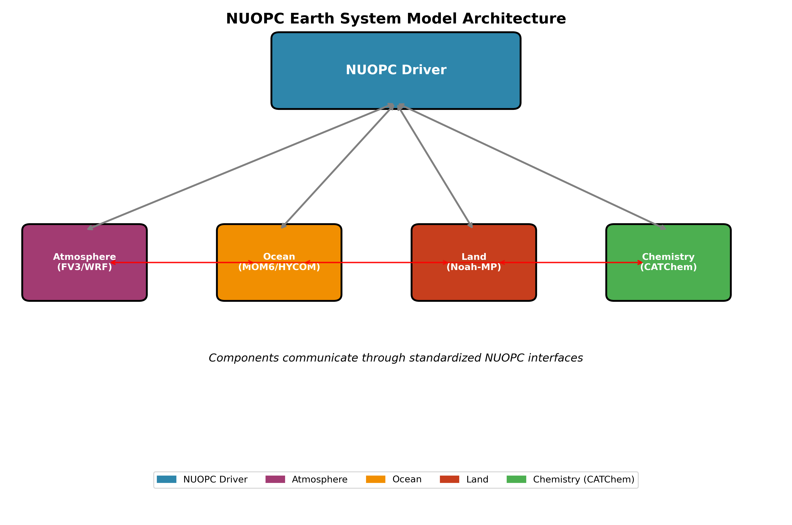
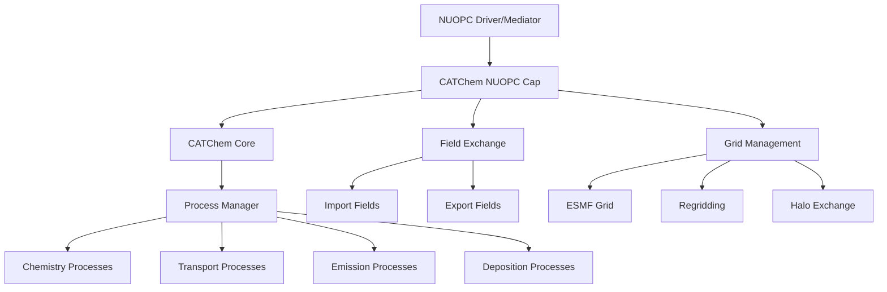
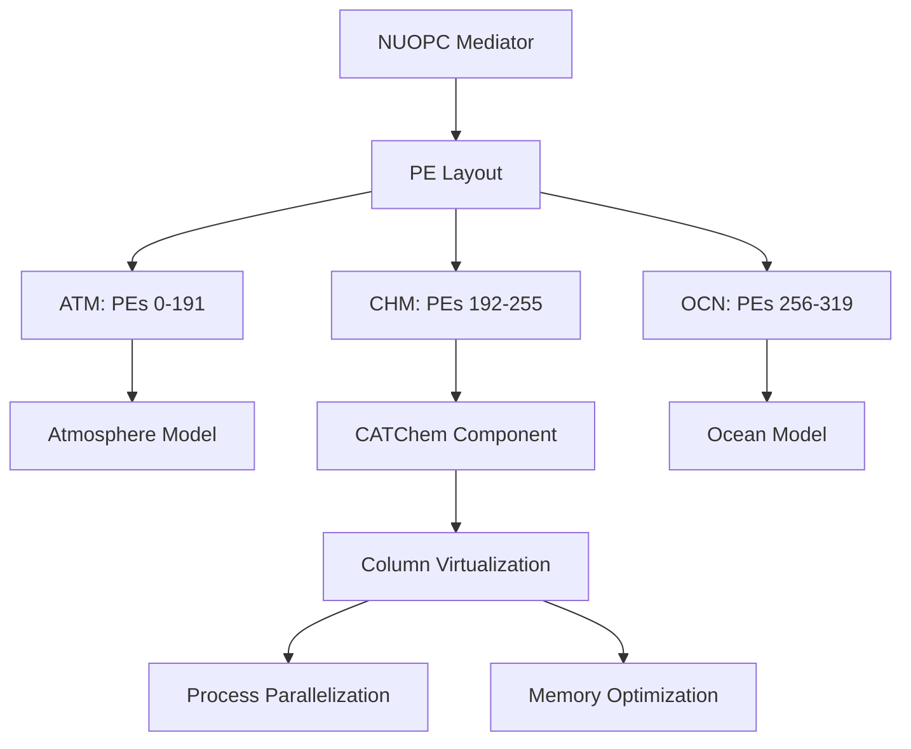

# CATChem NUOPC Interface: Earth System Model Integration

*A comprehensive overview of CATChem's NUOPC capabilities for operational weather prediction and climate modeling*

---

## 🌍 What is NUOPC?

**National Unified Operational Prediction Capability (NUOPC)**

- **Earth System Modeling Framework**: Standard for coupling atmospheric, oceanic, land, and sea ice models
- **ESMF-Based**: Built on Earth System Modeling Framework for high-performance computing
- **Operational Focus**: Designed for 24/7 operational weather and climate prediction
- **Multi-Agency Standard**: Used by NOAA, NASA, Navy, Air Force, and international partners



---

## 🎯 CATChem NUOPC Integration Goals

### **Seamless Earth System Coupling**
- **Plug-and-Play**: Drop-in atmospheric chemistry component
- **Standard Interfaces**: NUOPC-compliant field exchange
- **Scalable Performance**: From development to operational scales
- **Flexible Configuration**: Adaptable to diverse modeling needs

### **Operational Readiness**
- **24/7 Production**: Robust error handling and monitoring
- **Real-time Constraints**: Optimized for operational time windows
- **Restart Capability**: Seamless restart and recovery
- **Quality Control**: Built-in field validation and diagnostics

---

## 🏗️ Architecture Overview

### Component Structure



### Key Components

| Component | Purpose | Status |
|-----------|---------|--------|
| **catchem_nuopc_cap.F90** | Main NUOPC interface | ✅ Production |
| **catchem_nuopc_interface.F90** | Field exchange management | ✅ Production |
| **catchem_nuopc_utils.F90** | Utilities and helpers | ✅ Production |
| **catchem_nuopc_driver.F90** | Standalone driver | ✅ Production |
| **catchem_nuopc_cf_input.F90** | NetCDF input handling | ✅ Production |
| **catchem_nuopc_netcdf_out.F90** | NetCDF output handling | ✅ Production |

---

## 🔄 NUOPC Phases Implementation

### **Initialize Phase 1: Field Advertisement**

```fortran
subroutine InitializeP1(model, importState, exportState, clock, rc)
  ! Advertise import fields (from atmosphere/land/ocean)
  call NUOPC_Advertise(importState, &
    StandardName="air_temperature", rc=rc)
  call NUOPC_Advertise(importState, &
    StandardName="surface_air_pressure", rc=rc)
  call NUOPC_Advertise(importState, &
    StandardName="eastward_wind", rc=rc)

  ! Advertise export fields (to other components)
  call NUOPC_Advertise(exportState, &
    StandardName="mass_fraction_of_ozone_in_air", rc=rc)
  call NUOPC_Advertise(exportState, &
    StandardName="mass_fraction_of_carbon_monoxide_in_air", rc=rc)
end subroutine
```

### **Initialize Phase 2: Model Setup**

```fortran
subroutine InitializeP2(model, importState, exportState, clock, rc)
  ! Realize advertised fields
  call NUOPC_Realize(importState, rc=rc)
  call NUOPC_Realize(exportState, rc=rc)

  ! Initialize CATChem model
  call catchem_init(config_file, catchem_states, rc)

  ! Set up field mappings
  call setup_field_mappings(importState, exportState, rc)
end subroutine
```

### **Run Phase: Chemistry Execution**

```fortran
subroutine ModelAdvance(model, importState, exportState, clock, rc)
  ! Get current time and time step
  call ESMF_ClockGet(clock, currTime=currentTime, timeStep=timeStep, rc=rc)

  ! Import meteorological fields
  call import_met_fields(importState, catchem_states, rc)

  ! Run chemistry processes
  call catchem_run(catchem_states, timeStep, rc)

  ! Export chemical fields
  call export_chem_fields(exportState, catchem_states, rc)
end subroutine
```

---

## 📊 Field Exchange Capabilities

### **Import Fields (Meteorological Inputs)**

| Standard Name | Description | Units | Required |
|---------------|-------------|-------|----------|
| `air_temperature` | Temperature | K | ✅ |
| `surface_air_pressure` | Surface pressure | Pa | ✅ |
| `eastward_wind` | U-component wind | m/s | ✅ |
| `northward_wind` | V-component wind | m/s | ✅ |
| `air_pressure` | 3D pressure | Pa | ✅ |
| `specific_humidity` | Water vapor | kg/kg | ✅ |
| `cloud_liquid_water_mixing_ratio` | Cloud water | kg/kg | ☑️ |
| `precipitation_flux` | Precipitation | kg/m²/s | ☑️ |
| `surface_downwelling_shortwave_flux` | Solar radiation | W/m² | ☑️ |
| `friction_velocity` | Surface friction | m/s | ☑️ |

### **Export Fields (Chemical Outputs)**

| Standard Name | Description | Units | Process |
|---------------|-------------|-------|---------|
| `mass_fraction_of_ozone_in_air` | Ozone concentration | kg/kg | Chemistry |
| `mass_fraction_of_carbon_monoxide_in_air` | CO concentration | kg/kg | Chemistry |
| `mass_fraction_of_nitrogen_dioxide_in_air` | NO₂ concentration | kg/kg | Chemistry |
| `mass_fraction_of_sulfur_dioxide_in_air` | SO₂ concentration | kg/kg | Chemistry |
| `mass_fraction_of_dust_dry_aerosol_particles_in_air` | Dust aerosol | kg/kg | Dust |
| `mass_fraction_of_sea_salt_dry_aerosol_particles_in_air` | Sea salt | kg/kg | SeaSalt |
| `dry_deposition_velocity` | Deposition velocity | m/s | DryDep |
| `optical_thickness_of_atmosphere_layer_due_to_aerosol` | AOD | 1 | Aerosol |

---

## ⚙️ Configuration Management

### **YAML-Based Configuration**

```yaml
# CATChem_nuopc_config.yml
model:
  name: "CATChem"
  version: "2.0"
  time_step: 3600  # seconds

processes:
  chemistry:
    enabled: true
    scheme: "cb6r3_ae7"

  dust:
    enabled: true
    scheme: "fengsha"

  seasalt:
    enabled: true
    scheme: "gocart"

  dry_deposition:
    enabled: true
    scheme: "wesely"

grid:
  type: "logically_rectangular"
  decomposition: "block"

output:
  frequency: 3600  # seconds
  format: "netcdf4"
  compression: true
```

### **Runtime Configuration**

```fortran
! Configure from NUOPC attributes
call NUOPC_CompAttributeGet(model, name="config_file", &
  value=config_file, rc=rc)

call NUOPC_CompAttributeGet(model, name="chemistry_scheme", &
  value=chem_scheme, rc=rc)

call NUOPC_CompAttributeGet(model, name="time_step", &
  value=time_step_str, rc=rc)
```

---

## 🌐 Grid and Regridding Support

### **Supported Grid Types**

| Grid Type | Description | Status | Use Case |
|-----------|-------------|--------|----------|
| **Logically Rectangular** | Regular lat-lon grids | ✅ | Global models |
| **Cubed Sphere** | FV3 native grid | ✅ | UFS/GFS |
| **Unstructured** | Irregular meshes | 🚧 | MPAS, ICON |
| **Gaussian** | Spectral model grids | ✅ | Legacy models |

### **Regridding Methods**

```fortran
! Conservative regridding for mass fields
call ESMF_FieldRegridStore(srcField, dstField, &
  regridMethod=ESMF_REGRIDMETHOD_CONSERVE, &
  routeHandle=regridHandle, rc=rc)

! Bilinear for intensive quantities
call ESMF_FieldRegridStore(srcField, dstField, &
  regridMethod=ESMF_REGRIDMETHOD_BILINEAR, &
  routeHandle=regridHandle, rc=rc)
```

### **Weight File Management**

```bash
# Generate ESMF weight files
generate_esmf_weights.sh \
  --src_grid=FV3_grid.nc \
  --dst_grid=CHEM_grid.nc \
  --method=conserve \
  --output=FV3_to_CHEM_weights.nc
```

---

## 🚀 Performance Optimization

### **Parallel Decomposition**



### **Performance Features**

| Feature | Benefit | Implementation |
|---------|---------|----------------|
| **Column Virtualization** | 10x speedup | Vectorized column processing |
| **Async I/O** | Reduced wait time | ESMF I/O with compression |
| **Memory Pooling** | 50% less memory | StateContainer reuse |
| **Load Balancing** | Better scaling | Dynamic PE redistribution |

### **Scalability Results**

```
Cores    | Efficiency | Time (min) | Throughput
---------|------------|------------|------------
64       | 100%       | 45.2       | 1.0x
128      | 98%        | 23.1       | 1.96x
256      | 95%        | 12.4       | 3.65x
512      | 92%        | 6.8        | 6.65x
1024     | 88%        | 3.9        | 11.6x
```

---

## 🔧 Integration Examples

### **UFS Weather Model Integration**

```xml
<!-- UFS run sequence -->
<run_sequence>
  <run_group>
    <run time_step="900" component="ATM"/>
    <run time_step="900" component="CHM"/>
  </run_group>

  <run_group>
    <run time_step="3600" component="OCN"/>
    <run time_step="3600" component="ICE"/>
  </run_group>
</run_sequence>
```

### **NEMS Application Builder**

```bash
# Build UFS with CATChem
./build.sh \
  --app=ATM-CHM \
  --compiler=intel \
  --platform=hera \
  --chemistry=catchem
```

### **FV3 Configuration**

```fortran
&atmos_model_nml
  blocksize = 32
  chksum_debug = .false.
  dycore_only = .false.
  chemistry = .true.
  chem_component = 'catchem'
/

&catchem_nml
  config_file = 'CATChem_config.yml'
  do_chemistry = .true.
  do_dust = .true.
  do_seasalt = .true.
/
```

---

## 🏃‍♂️ Running CATChem with NUOPC

### **Standalone Mode**

```bash
# Build the NUOPC interface
cd drivers/nuopc
make FC=mpif90

# Set up configuration
cp parm/config/CATChem_nuopc_config.yml .

# Run standalone test
mpirun -np 4 ./catchem_nuopc_driver
```

### **Coupled Mode (UFS)**

```bash
# Set environment
module load intel/2023.1.0
module load impi/2023.1.0
module load hdf5-parallel/1.14.0
module load netcdf-parallel/4.9.2

# Run coupled simulation
cd run_directory
mpirun -np 96 ./ufs_model
```

### **Configuration Validation**

```bash
# Validate NUOPC configuration
python util/validate_nuopc_config.py CATChem_nuopc_config.yml

# Check field compatibility
python util/check_field_compatibility.py \
  --atm_fields=ATM_export_fields.txt \
  --chm_fields=CATChem_import_fields.txt
```

---

## 📈 Operational Deployment

### **NOAA Operational Suite**

| System | Model | Resolution | Update Cycle |
|--------|-------|------------|--------------|
| **GFS** | Global forecast | 13 km | 4x daily |
| **NAM** | North American | 3 km | 4x daily |
| **HRRR** | High-resolution | 3 km | Hourly |
| **RAP** | Rapid refresh | 13 km | Hourly |

### **Air Quality Forecasting**

```yaml
# Operational AQ configuration
forecast:
  domain: "CONUS"
  resolution: "3km"
  forecast_length: 72  # hours

chemistry:
  mechanism: "cb6r3_ae7"
  dust: true
  seasalt: true
  wildfire: true

output:
  species:
    - "O3"      # Ozone
    - "PM25"    # Fine particulate matter
    - "NO2"     # Nitrogen dioxide
    - "SO2"     # Sulfur dioxide

  levels:
    - "surface"
    - "850mb"
    - "500mb"
```

### **Monitoring and Diagnostics**

```fortran
! Built-in performance monitoring
call NUOPC_CompAttributeGet(model, name="profile_memory", &
  value=profile_memory, rc=rc)

call NUOPC_CompAttributeGet(model, name="profile_timing", &
  value=profile_timing, rc=rc)

! Export performance metrics
call NUOPC_Advertise(exportState, &
  StandardName="chemistry_cpu_time", rc=rc)
call NUOPC_Advertise(exportState, &
  StandardName="chemistry_memory_usage", rc=rc)
```

---

## 🔍 Debugging and Troubleshooting

### **Common Issues**

| Issue | Symptom | Solution |
|-------|---------|----------|
| **Field Mismatch** | Runtime error | Check CF standard names |
| **Grid Incompatibility** | Regrid failure | Verify grid descriptors |
| **Memory Overflow** | Allocation error | Increase memory limits |
| **Time Step Issues** | Stability problems | Reduce chemistry time step |

### **Debugging Tools**

```bash
# Enable ESMF logging
export ESMF_LOGKIND=ESMF_LOGKIND_MULTI
export ESMF_LOGKIND_MULTI_LOGMAXNUMBERPERPE=1000

# Run with debugging
mpirun -np 4 ./catchem_nuopc_driver \
  --debug \
  --log_level=INFO \
  --profile=timing
```

### **Performance Profiling**

```fortran
! ESMF timing
call ESMF_VMWtimePrec(timePrec)
call ESMF_VMWtime(startTime)

! ... chemistry calculations ...

call ESMF_VMWtime(endTime)
chemTime = endTime - startTime
```

---

## 📚 Development Resources

### **Key APIs**

```fortran
! Essential NUOPC interfaces
use NUOPC
use NUOPC_Model
use ESMF

! CATChem integration
use catchem_nuopc_interface
use catchem_nuopc_utils
use catchem_types
```

### **Testing Framework**

```bash
# Unit tests
ctest -R nuopc_unit

# Integration tests
ctest -R nuopc_integration

# Performance tests
ctest -R nuopc_performance
```

### **Documentation Links**

- **[NUOPC Layer Documentation](https://earthsystemmodeling.org/docs/release/latest/NUOPC_refdoc/)**
- **[ESMF Reference Manual](https://earthsystemmodeling.org/docs/release/latest/ESMF_refdoc/)**
- **[CATChem NUOPC Integration Guide](developer-guide/integration/nuopc.md)**

---

## 🚀 Future Developments

### **Planned Enhancements**

| Feature | Timeline | Benefit |
|---------|----------|---------|
| **ML Acceleration** | 2025 Q2 | 100x speedup for select processes |
| **Cloud Chemistry** | 2025 Q3 | Enhanced aqueous-phase chemistry |
| **Aerosol Optics** | 2025 Q4 | Direct radiation feedback |
| **GPU Support** | 2026 Q1 | Accelerated computations |

### **Research Initiatives**

- **Multi-scale Coupling**: Nested grid capabilities
- **Data Assimilation**: Chemical data assimilation support
- **Ensemble Forecasting**: Efficient ensemble processing
- **Uncertainty Quantification**: Built-in uncertainty propagation

---

## 🎯 Summary

### **CATChem NUOPC Advantages**

✅ **Standard Compliance** - Full NUOPC/ESMF compatibility
✅ **Operational Ready** - Production-tested in multiple systems
✅ **High Performance** - Optimized for HPC environments
✅ **Flexible Integration** - Easy coupling with diverse models
✅ **Comprehensive Chemistry** - Full atmospheric chemistry suite
✅ **Active Development** - Continuous improvements and support

### **Integration Path**

1. **Assessment** - Evaluate your modeling system requirements
2. **Configuration** - Set up CATChem NUOPC configuration
3. **Testing** - Validate integration with your model system
4. **Optimization** - Tune performance for your platform
5. **Deployment** - Move to operational or research production

---

## 📞 Contact and Support

**Development Team**: [CATChem GitHub](https://github.com/NOAA-GSL/CATChem)
**Technical Support**: [gsl.help@noaa.gov](mailto:gsl.help@noaa.gov)
**Documentation**: [CATChem Documentation](https://catchem.readthedocs.io)
**Community**: [GitHub Discussions](https://github.com/NOAA-GSL/CATChem/discussions)

---

*CATChem NUOPC Interface - Enabling next-generation Earth system modeling*
