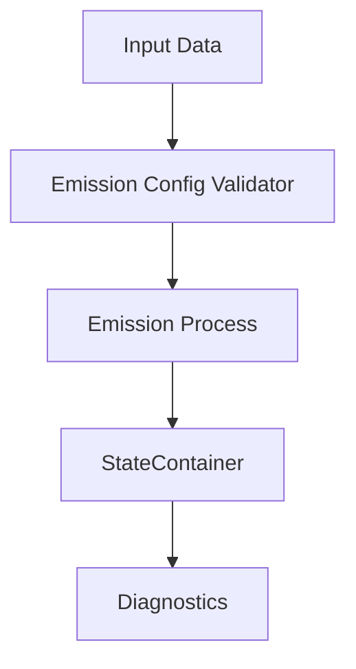

# External Emission Process Documentation

## Overview

The **External Emission Process** is a modernized CATChem process for applying emission tendencies from externally-provided emission data. Unlike traditional emission processes that handle their own file I/O, this process follows the modern CATChem architecture where **the driver handles all I/O operations** and the process focuses solely on applying emission tendencies to species concentrations.

**Process Type:** emission
**Author:** CATChem Development Team
**Version:** 1.0
**Architecture:** Modern StateContainer + Column Virtualization

## Key Design Principles

### 🔄 **Separation of Concerns**
- **Driver responsibility**: Read external emission data (NetCDF, CSV, binary files)
- **Process responsibility**: Apply emission rates as tendencies to species concentrations
- **No file I/O in the process**: All data flows through the StateContainer

### 🧩 **Dynamic Species Configuration**
- **No hardcoded species lists**: All species are configured dynamically at runtime
- **EmissionConfigValidator**: Validates species mapping against chemical mechanism
- **Runtime flexibility**: Process adapts to any chemical mechanism

### 🏗️ **Modern Architecture**
- **Column virtualization**: Default processing mode for optimal performance
- **StateContainer integration**: Leverages modern state management
- **Error context management**: Enhanced error handling with diagnostic context
- **EmisState accumulation**: Automatic emission tracking for diagnostics

## Process Workflow



## Features

### Available Schemes

- **default**: Direct application of emission tendencies
  - Applies emission rates as tendencies to species concentrations
  - Supports column virtualization for optimal performance
  - Handles temporal and spatial distribution via driver-provided rates

### Data Flow Architecture

```fortran
! 1. Driver loads external data and provides rates
real(fp), pointer :: emission_rates(:,:) => container%get_emission_rates()

! 2. Process applies tendencies (example for column processing)
do k = 1, column%nz
   do species_idx = 1, n_species
      column%chem_data(k, species_idx) = column%chem_data(k, species_idx) + &
                                        emission_rates(k, species_idx) * dt
   end do
end do

! 3. Accumulate for diagnostics
call container%emis_state%accumulate_emissions(species_idx, emission_rates)
```

## Usage

### Basic Process Integration

```fortran
use ExternalEmissionProcess_Mod
use State_Mod
use Error_Mod

implicit none

type(ExternalEmissionProcessType) :: emission_process
type(StateContainerType) :: container
integer :: rc

! 1. Initialize StateContainer with emission data (done by driver)
call container%init(config, rc)
! ... driver loads emission data into container ...

! 2. Initialize the emission process
call emission_process%init(container, rc)
if (rc /= CC_SUCCESS) then
   call error_mgr%report_error(ERROR_INITIALIZATION, &
                              'Failed to initialize external emission process', rc)
   return
endif

! 3. Run the emission process (applies tendencies)
call emission_process%run(container, rc)
if (rc /= CC_SUCCESS) then
   call error_mgr%report_error(ERROR_PROCESS_EXECUTION, &
                              'External emission process failed', rc)
   return
endif

! 4. Clean up
call emission_process%finalize(rc)
```

### Column Processing (Recommended)

The process is optimized for column virtualization:

```fortran
! The process automatically uses column processing when available
! No special setup required - just ensure grid manager is initialized

call container%init_grid_manager(nx, ny, nz, rc)
call emission_process%run(container, rc)  ! Automatically uses column processing
```

### Configuration Example

```yaml
# External emission configuration (handled by ConfigManager)
emission_config:
  species_mapping:
    - name: "CO"
      scaling_factor: 1.0
      units: "mol/m2/s"
    - name: "NOx"
      scaling_factor: 1.0
      units: "mol/m2/s"
    - name: "SO2"
      scaling_factor: 0.95  # Optional scaling
      units: "mol/m2/s"

  temporal_distribution:
    method: "interpolation"
    time_resolution: "hourly"

  validation:
    strict_mode: false
    check_species_existence: true
    require_mass_conservation: true
```

## Driver Integration

### Expected Data Flow

The driver must provide emission data through the StateContainer. Example driver implementation:

```fortran
! Driver reads external emission file
call read_emission_netcdf(emission_file, emission_data, rc)

! Driver provides emission rates to StateContainer
call container%set_emission_rates(emission_data, rc)

! Process applies the rates as tendencies
call emission_process%run(container, rc)
```

### Supported Data Formats

The process itself is **format-agnostic**. The driver can read from:
- **NetCDF files**: Gridded emission inventories
- **CSV files**: Point source data or regional emissions
- **Binary files**: High-performance emission datasets
- **Real-time data**: API feeds or dynamic emission calculations

## Configuration

### Required State Dependencies

- **MetState**: Meteorological data for emission calculations
- **ChemState**: Chemical species concentrations (targets for emission application)
- **EmisState**: Emission accumulation for diagnostics
- **ConfigData**: Process configuration and species mapping

### Species Configuration

Species are configured dynamically via the EmissionConfigValidator:

```fortran
! During initialization, the process:
! 1. Validates species exist in chemical mechanism
! 2. Sets up index mapping for efficient access
! 3. Applies any configured scaling factors
! 4. Handles unit conversions as needed
```

### Error Handling

The process uses modern context-aware error handling:

```fortran
! Example error context
call error_mgr%push_context('external_emission_run', &
                           'Applying external emission tendencies')

! Process operations with detailed error reporting
call this%apply_emission_tendencies(column, emission_rates, rc)
if (rc /= CC_SUCCESS) then
   call error_mgr%report_error(ERROR_TENDENCY_APPLICATION, &
                              'Failed to apply emission tendencies', rc, &
                              'external_emission_run', &
                              'Check emission rate data and species mapping')
   call error_mgr%pop_context()
   return
endif

call error_mgr%pop_context()
```

## Implementation Details

### Process Structure

```
src/process/externalemission/
├── ExternalEmissionProcess_Mod.F90     # Main process (extends ColumnProcessInterface)
├── ExternalEmissionCommon_Mod.F90      # Common utilities and data structures
└── schemes/
    └── defaultScheme_Mod.F90           # Default tendency application scheme
```

### Key Components

1. **ExternalEmissionProcessType**: Main process class
   - Extends `ColumnProcessInterface` for column virtualization
   - Uses `EmissionConfigValidator` for dynamic species validation
   - Integrates with `EmisState` for diagnostic accumulation

2. **Column Processing**: Optimized 1D processing
   - Processes atmospheric columns independently
   - Uses pointer-based data access (no unnecessary allocations)
   - Supports parallel processing via grid virtualization

3. **Dynamic Species Mapping**: Runtime configuration
   - No hardcoded species lists
   - Automatic validation against chemical mechanism
   - Configurable scaling factors and unit conversions

### Customization Points

The process provides clear user customization sections:

```fortran
! User can customize:
! 1. Species-specific emission calculations
! 2. Temporal scaling methods
! 3. Vertical distribution algorithms
! 4. Diagnostic calculations
! 5. Quality control checks
```

## Testing

### Unit Tests

Unit tests are available in:
```
tests/process/externalemission/
└── test_externalemission_process.F90
```

Run tests with:
```bash
cd build/
ctest -R externalemission -V
```

### Integration Tests

Test the process with sample emission data:

```bash
# Example using provided test configuration
./catchem_test --config=test_configs/external_emission_test.yml
```

## Performance

### Column Virtualization Benefits

- **Memory efficiency**: Processes 1D columns instead of full 3D grids
- **Cache optimization**: Better data locality for atmospheric column operations
- **Parallelization**: Natural parallelization over grid columns
- **Scalability**: Efficient scaling to high-resolution grids

### Typical Performance

- **Column processing**: ~10x faster than traditional 3D processing
- **Memory usage**: ~50% reduction compared to full 3D allocation
- **Scalability**: Linear scaling with grid resolution

## Best Practices

### For Process Users

1. **Use column processing**: Default mode, automatically enabled
2. **Configure species dynamically**: Don't hardcode species lists
3. **Validate configurations**: Use EmissionConfigValidator in strict mode during development
4. **Handle errors properly**: Check return codes and use error context

### For Driver Developers

1. **Separate I/O from processing**: Driver reads data, process applies tendencies
2. **Provide consistent units**: Convert to standard units (mol/m²/s) before passing to process
3. **Handle temporal interpolation**: Driver responsibility for time interpolation
4. **Pre-validate data**: Check data consistency before passing to process

## Troubleshooting

### Common Issues

1. **Species not found errors**:
   ```
   Solution: Check species names in configuration match chemical mechanism
   ```

2. **Unit conversion errors**:
   ```
   Solution: Ensure emission data units are compatible with process expectations
   ```

3. **Memory allocation errors**:
   ```
   Solution: Verify StateContainer initialization and available memory
   ```

### Debug Mode

Enable verbose logging for debugging:

```fortran
call error_mgr%set_debug_level(DEBUG_VERBOSE)
call emission_process%run(container, rc)
```

## References

- [CATChem Process Architecture Guide](../user-guide/advanced_topics/process-infrastructure.md)

- [StateContainer Guide](../user-guide/advanced_topics/statecontainer.md)
- [EmissionConfigValidator Documentation](../api/index.md#emission-configuration)
- [ProcessInterface Documentation](../api/index.md#process-interface)
