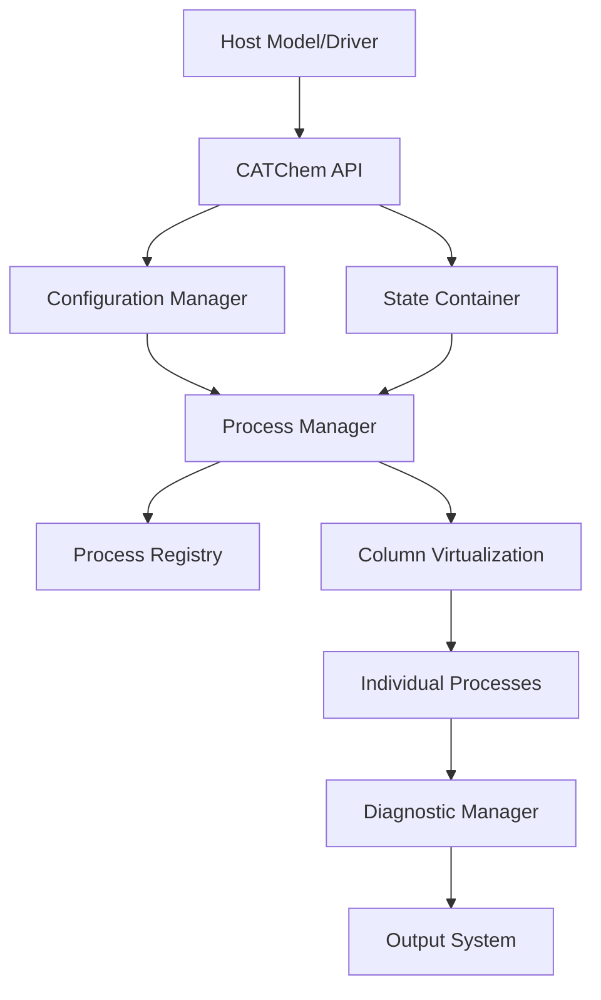

# Model Overview

CATChem is a modern atmospheric chemistry library and modeling component that can be integrated into atmospheric chemistry models used for operational weather, smoke, and air quality prediction and research applications.

## Architecture



## Quick Start

=== "Installation"

    ```bash
    # Clone the repository
    git clone https://github.com/UFS-Community/CATChem.git
    cd CATChem

    # Build with CMake
    mkdir build && cd build
    cmake ..
    make -j$(nproc)
    ```

=== "Testing"

    ```bash
    # Run a test case
    cd build
    ctest -R test_CATChemCore

    ```

=== "Integration"

    ```fortran
    ! Integrate with your model
    use CATChemAPI_Mod

    type(CATChemType) :: catchem

    call catchem%init(config_file, rc)
    call catchem%run(dt, met_fields, chem_fields, rc)
    call catchem%finalize(rc)
    ```

## Core Components

### State Management
The **StateContainer** is the central data repository that manages:

- Chemical species concentrations
- Meteorological fields (temperature, pressure, wind, etc.)
- Diagnostic variables
- Grid and coordinate information
- Memory allocation and cleanup

### Process System
CATChem implements atmospheric chemistry and physics as discrete **processes**:

- Each process handles a specific physical/chemical phenomenon
- Processes operate independently on the StateContainer
- Clean interfaces enable easy testing and development
- Pluggable schemes allow multiple implementations

### Column Virtualization
The **Column Interface** provides efficient 1D processing:

- Atmospheric columns processed independently
- Automatic parallelization across columns
- Optimized memory access patterns
- Linear scaling to thousands of cores

## Supported Processes

### Transport Processes
- **Gravitational Settling**: Stokes law with slip correction
- **Vertical Mixing**: Host model responsibility
- **Horizontal Advection**: Host model responsibility

### Chemical Processes
- **Gas-phase Chemistry**: Configurable chemical mechanisms
- **Aerosol Chemistry**: Particle formation and growth
- **Photolysis**: Solar radiation-dependent reactions

### Emission Processes
- **External Emissions**: Anthropogenic and biogenic sources
- **Dust Emission**: Wind-driven mineral dust generation
- **Sea Salt**: Marine aerosol production
- **Wildfire Emissions**: Plume rise and injection height

### Loss Processes
- **Dry Deposition**: Surface uptake and removal
- **Wet Deposition**: Precipitation scavenging
- **Chemical Loss**: Reaction-based removal

## Model Grids

CATChem supports multiple grid types:

### Latitude-Longitude Grids
- Regular rectangular grids
- Gaussian grids
- Variable resolution grids

### Cubed-Sphere Grids
- FV3 native grid support
- Gnomonic projection
- Uniform global resolution

### Unstructured Grids
- MPAS grid support
- Voronoi tessellation
- Adaptive mesh refinement

## Configuration

### YAML-Based Configuration
```yaml
# Model domain
domain:
  grid_type: "lat_lon"
  resolution: "0.25deg"
  vertical_levels: 64

# Time control
time:
  start_date: "2025-01-01T00:00:00Z"
  end_date: "2025-01-02T00:00:00Z"
  time_step: 300

# Active processes
processes:
  - name: "settling"
    scheme: "Stokesscheme"
    enabled: true

  - name: "chemistry"
    scheme: "GOCART"
    enabled: true
```

### Flexible Process Configuration
- Enable/disable processes independently
- Multiple scheme options per process
- Process-specific parameter tuning
- Runtime configuration updates

## Performance Features

### Memory Efficiency
- Pool-based memory management
- Lazy allocation strategies
- Automatic garbage collection
- Memory usage monitoring

### Computational Efficiency
- Column-based processing for cache optimization
- SIMD vectorization support
- OpenMP parallelization
- Minimal data copying

### Scalability
- Linear scaling to 10,000+ cores
- Efficient MPI communication
- Load balancing algorithms
- Memory-distributed processing

## Integration Capabilities

### Host Model Integration
- **CCPP Interface**: Standard physics package integration (not implmented currently)
- **NUOPC Component**: ESMF-based coupling framework
- **FV3 Integration**: Direct coupling with FV3 dynamical core (not implmented currently)
- **Standalone Mode**: Independent execution capability

### Data Exchange
- Standardized field interfaces
- Flexible unit conversion
- Grid interpolation support
- Time interpolation capabilities

## Quality Assurance

### Testing Framework
- Comprehensive unit test suite
- Integration testing infrastructure
- Performance benchmarking
- Regression testing

### Verification and Evaluation
- Intermodel comparisons
- Observational evaluation

### Error Handling
- Robust error detection and reporting
- Graceful degradation strategies
- Diagnostic output for debugging
- Recovery mechanisms

## Development Workflow

### Modern Software Practices
- Git version control with clear branching strategy
- Continuous integration with automated testing
- Code review process for all changes
- Documentation generation from source code

### Extensibility
- Plugin architecture for new processes
- Template-based code generation
- Clear API specifications
- Comprehensive developer documentation

---

*CATChem represents a modern approach to atmospheric chemistry modeling, emphasizing performance, maintainability, and scientific accuracy.*
